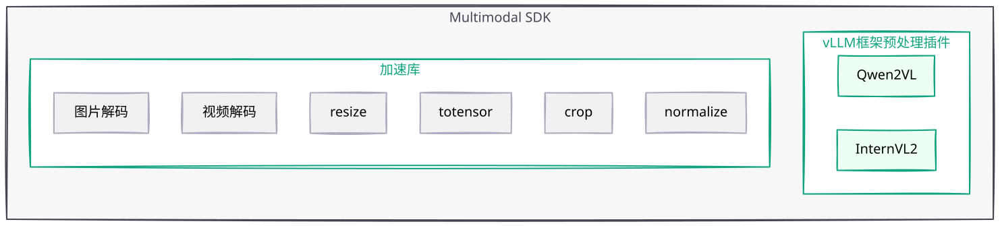

<h1 align="center">Multimodal SDK</h1>

[![Zread](https://img.shields.io/badge/Zread-Ask_AI-_.svg?style=flat&color=0052D9&labelColor=000000&logo=data%3Aimage%2Fsvg%2Bxml%3Bbase64%2CPHN2ZyB3aWR0aD0iMTYiIGhlaWdodD0iMTYiIHZpZXdCb3g9IjAgMCAxNiAxNiIgZmlsbD0ibm9uZSIgeG1sbnM9Imh0dHA6Ly93d3cudzMub3JnLzIwMDAvc3ZnIj4KPHBhdGggZD0iTTQuOTYxNTYgMS42MDAxSDIuMjQxNTZDMS44ODgxIDEuNjAwMSAxLjYwMTU2IDEuODg2NjQgMS42MDE1NiAyLjI0MDFWNC45NjAxQzEuNjAxNTYgNS4zMTM1NiAxLjg4ODEgNS42MDAxIDIuMjQxNTYgNS42MDAxSDQuOTYxNTZDNS4zMTUwMiA1LjYwMDEgNS42MDE1NiA1LjMxMzU2IDUuNjAxNTYgNC45NjAxVjIuMjQwMUM1LjYwMTU2IDEuODg2NjQgNS4zMTUwMiAxLjYwMDEgNC45NjE1NiAxLjYwMDFaIiBmaWxsPSIjZmZmIi8%2BCjxwYXRoIGQ9Ik00Ljk2MTU2IDEwLjM5OTlIMi4yNDE1NkMxLjg4ODEgMTAuMzk5OSAxLjYwMTU2IDEwLjY4NjQgMS42MDE1NiAxMS4wMzk5VjEzLjc1OTlDMS42MDE1NiAxNC4xMTM0IDEuODg4MSAxNC4zOTk5IDIuMjQxNTYgMTQuMzk5OUg0Ljk2MTU2QzUuMzE1MDIgMTQuMzk5OSA1LjYwMTU2IDE0LjExMzQgNS42MDE1NiAxMy43NTk5VjExLjAzOTlDNS42MDE1NiAxMC42ODY0IDUuMzE1MDIgMTAuMzk5OSA0Ljk2MTU2IDEwLjM5OTlaIiBmaWxsPSIjZmZmIi8%2BCjxwYXRoIGQ9Ik0xMy43NTg0IDEuNjAwMUgxMS4wMzg0QzEwLjY4NSAxLjYwMDEgMTAuMzk4NCAxLjg4NjY0IDEwLjM5ODQgMi4yNDAxVjQuOTYwMUMxMC4zOTg0IDUuMzEzNTYgMTAuNjg1IDUuNjAwMSAxMS4wMzg0IDUuNjAwMUgxMy43NTg0QzE0LjExMTkgNS42MDAxIDE0LjM5ODQgNS4zMTM1NiAxNC4zOTg0IDQuOTYwMVYyLjI0MDFDMTQuMzk4NCAxLjg4NjY0IDE0LjExMTkgMS42MDAxIDEzLjc1ODQgMS42MDAxWiIgZmlsbD0iI2ZmZiIvPgo8cGF0aCBkPSJNNCAxMkwxMiA0TDQgMTJaIiBmaWxsPSIjZmZmIi8%2BCjxwYXRoIGQ9Ik00IDEyTDEyIDQiIHN0cm9rZT0iI2ZmZiIgc3Ryb2tlLXdpZHRoPSIxLjUiIHN0cm9rZS1saW5lY2FwPSJyb3VuZCIvPgo8L3N2Zz4K&logoColor=ffffff)](https://zread.ai/Ascend/MultimodalSDK)
[![DeepWiki](https://img.shields.io/badge/DeepWiki-Ask_AI-_.svg?style=flat&color=0052D9&labelColor=000000&logo=data:image/png;base64,iVBORw0KGgoAAAANSUhEUgAAACwAAAAyCAYAAAAnWDnqAAAAAXNSR0IArs4c6QAAA05JREFUaEPtmUtyEzEQhtWTQyQLHNak2AB7ZnyXZMEjXMGeK/AIi+QuHrMnbChYY7MIh8g01fJoopFb0uhhEqqcbWTp06/uv1saEDv4O3n3dV60RfP947Mm9/SQc0ICFQgzfc4CYZoTPAswgSJCCUJUnAAoRHOAUOcATwbmVLWdGoH//PB8mnKqScAhsD0kYP3j/Yt5LPQe2KvcXmGvRHcDnpxfL2zOYJ1mFwrryWTz0advv1Ut4CJgf5uhDuDj5eUcAUoahrdY/56ebRWeraTjMt/00Sh3UDtjgHtQNHwcRGOC98BJEAEymycmYcWwOprTgcB6VZ5JK5TAJ+fXGLBm3FDAmn6oPPjR4rKCAoJCal2eAiQp2x0vxTPB3ALO2CRkwmDy5WohzBDwSEFKRwPbknEggCPB/imwrycgxX2NzoMCHhPkDwqYMr9tRcP5qNrMZHkVnOjRMWwLCcr8ohBVb1OMjxLwGCvjTikrsBOiA6fNyCrm8V1rP93iVPpwaE+gO0SsWmPiXB+jikdf6SizrT5qKasx5j8ABbHpFTx+vFXp9EnYQmLx02h1QTTrl6eDqxLnGjporxl3NL3agEvXdT0WmEost648sQOYAeJS9Q7bfUVoMGnjo4AZdUMQku50McDcMWcBPvr0SzbTAFDfvJqwLzgxwATnCgnp4wDl6Aa+Ax283gghmj+vj7feE2KBBRMW3FzOpLOADl0Isb5587h/U4gGvkt5v60Z1VLG8BhYjbzRwyQZemwAd6cCR5/XFWLYZRIMpX39AR0tjaGGiGzLVyhse5C9RKC6ai42ppWPKiBagOvaYk8lO7DajerabOZP46Lby5wKjw1HCRx7p9sVMOWGzb/vA1hwiWc6jm3MvQDTogQkiqIhJV0nBQBTU+3okKCFDy9WwferkHjtxib7t3xIUQtHxnIwtx4mpg26/HfwVNVDb4oI9RHmx5WGelRVlrtiw43zboCLaxv46AZeB3IlTkwouebTr1y2NjSpHz68WNFjHvupy3q8TFn3Hos2IAk4Ju5dCo8B3wP7VPr/FGaKiG+T+v+TQqIrOqMTL1VdWV1DdmcbO8KXBz6esmYWYKPwDL5b5FA1a0hwapHiom0r/cKaoqr+27/XcrS5UwSMbQAAAABJRU5ErkJggg==)](https://deepwiki.com/Ascend/MultimodalSDK)

## ✨ 最新消息

🔹 **[2026.07.31]**：🚀 [Multimodal SDK 26.1.0 Release 版本发布](https://gitcode.com/Ascend/MultimodalSDK/releases/v26.1.0) 
🔹 **[2026.04.25]**：🚀 [Multimodal SDK 26.0.0 Release 版本发布](https://gitcode.com/Ascend/MultimodalSDK/releases/v26.0.0) 
🔹 **[2025.12.30]**：🚀 Multimodal SDK 开源发布 

## ℹ️ 简介

Multimodal SDK 是面向昇腾设备优化的多模态大模型推理预处理加速套件。它提供图像、视频和音频处理常用接口，覆盖图像/视频加载与解码、resize、crop、音频加载等预处理流程，并支持多种开源数据结构与加速库数据结构的相互转换，帮助开发者快速接入和迁移多模态推理应用。

## ⚙️ 功能介绍

| 功能 | 描述 | 接口 |
| --- | --- | --- |
| [图像处理](./docs/zh/04_user_guide/user_guide.md#图片处理) | 支持图像读取、resize、crop 及 NumPy 数据转换，适用于多模态模型图片预处理场景 | [链接](./docs/zh/05_api/function_reference.md) |
| [视频处理](./docs/zh/04_user_guide/user_guide.md#视频处理) | 支持按指定帧 ID 解码或按目标帧数均匀采样，返回可继续处理的 Image 对象列表 | [链接](./docs/zh/05_api/function_reference.md) |
| [音频处理](./docs/zh/04_user_guide/user_guide.md#音频处理) | 支持单文件、文件列表和目录批量音频加载，并可指定重采样率 | [链接](./docs/zh/05_api/function_reference.md) |
| [推理框架补丁](./docs/zh/05_api/patcher.md) | 提供 vLLM 框架补丁，便于在现有推理流程中集成加速能力 | [链接](./docs/zh/05_api/patcher.md) |

## 🚀 快速入门

Multimodal SDK 提供 Docker 快速体验流程，帮助用户完成环境启动、变量加载和首个 Python 示例验证，详情可参考《[快速入门](./docs/zh/02_quickstart/quickstart.md)》。

如果需要修改源码并重新编译，请直接参考《[贡献指南](./CONTRIBUTING.md)》。

## 📦 安装指南

Multimodal SDK 支持离线安装、镜像安装、源码安装三种方式，详情可查看《[安装指南](./docs/zh/03_installation_guide/installation_guide.md)》。

## 📘 使用指南

Multimodal SDK 以图片、视频和音频三个典型场景提供基础预处理接口使用样例与操作指导，具体操作请参考《[样例和指导](./docs/zh/04_user_guide/user_guide.md)》。

API 说明请参考：

| 文档 | 说明 |
| --- | --- |
| [功能函数参考](./docs/zh/05_api/function_reference.md) | Tensor、Image、video_decode、load_audio 等接口说明 |
| [patcher](./docs/zh/05_api/patcher.md) | vLLM 框架预处理加速补丁说明 |
| [Python 接口说明](./docs/zh/05_api/README.md) | 数据类型枚举与 API 文档入口 |

## 🗺️ Roadmap

[Roadmap(2026Q3)](https://gitcode.com/Ascend/MultimodalSDK/issues/40)

## 🔀 版本维护策略

| 版本 | 维护策略 | 当前状态 | 发布日期 | 后续状态 | EOL 日期 |
| --- | --- | --- | --- | --- | --- |
| master | 长期支持 | 开发 | 在研分支，不发布 | 持续开发 | - |
| v26.1.0 | 常规分支 | 维护 | 2026-07-31 | 预计2027-01-31起进入无维护状态 | 2027-01-31 |
| v26.0.0 | 常规分支 | 维护 | 2026-04-25 | 预计2026-10-25起进入无维护状态 | 2026-10-25 |

## 🛠️ 贡献指南

欢迎参与项目贡献，贡献流程和规范请参见《[贡献指南](./CONTRIBUTING.md)》。

## ⚖️ 相关说明

🔹 《[版本说明](./docs/zh/release_notes_mm.md)》 
🔹 《[安全加固](./docs/zh/06_references/security_hardening.md)》 
🔹 《[许可证声明](./LICENSE.md)》 
🔹 《[文档许可证声明](./docs/LICENSE)》 
🔹 《[免责声明](./docs/zh/01_introduction/02_disclaimer.md)》 
🔹 《[第三方开源软件声明](./Third_Party_Open_Source_Software_Notice)》

## 🤝 建议与交流

欢迎大家通过以下方式提出问题、交流讨论。

| 资源 | 说明 |
| :-- | :-- |
| [FAQ](./docs/zh/06_references/faq.md) | 常见问题解答与使用答疑 |
| [创建Issue](https://gitcode.com/Ascend/MultimodalSDK/issues/create/choose) | 提交 Bug、需求或建议 |
| [社区任务](https://gitcode.com/Ascend/MultimodalSDK/issues) | 查看和认领社区任务 |
| [会议日历](https://meeting.ascend.osinfra.cn/?sig=sig-MindSeriesSDK) | 社区定期例会与活动日程 |
