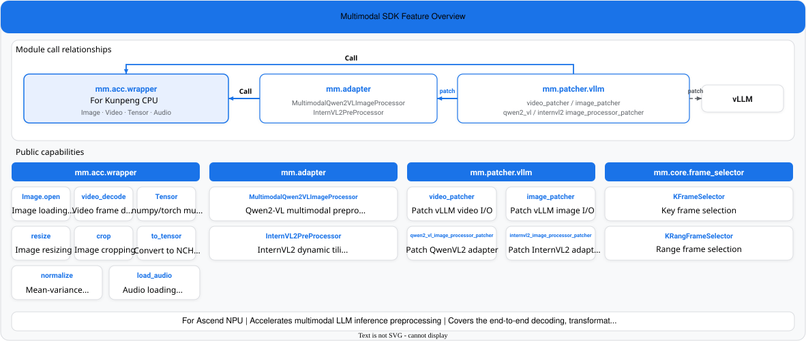

# Multimodal SDK

<h2>Ascend Multimodal Development Kit</h2>

[![Zread](https://img.shields.io/badge/Zread-Ask_AI-_.svg?style=flat&color=0052D9&labelColor=000000&logo=data%3Aimage%2Fsvg%2Bxml%3Bbase64%2CPHN2ZyB3aWR0aD0iMTYiIGhlaWdodD0iMTYiIHZpZXdCb3g9IjAgMCAxNiAxNiIgZmlsbD0ibm9uZSIgeG1sbnM9Imh0dHA6Ly93d3cudzMub3JnLzIwMDAvc3ZnIj4KPHBhdGggZD0iTTQuOTYxNTYgMS42MDAxSDIuMjQxNTZDMS44ODgxIDEuNjAwMSAxLjYwMTU2IDEuODg2NjQgMS42MDE1NiAyLjI0MDFWNC45NjAxQzEuNjAxNTYgNS4zMTM1NiAxLjg4ODEgNS42MDAxIDIuMjQxNTYgNS42MDAxSDQuOTYxNTZDNS4zMTUwMiA1LjYwMDEgNS42MDE1NiA1LjMxMzU2IDUuNjAxNTYgNC45NjAxVjIuMjQwMUM1LjYwMTU2IDEuODg2NjQgNS4zMTUwMiAxLjYwMDEgNC45NjE1NiAxLjYwMDFaIiBmaWxsPSIjZmZmIi8%2BCjxwYXRoIGQ9Ik00Ljk2MTU2IDEwLjM5OTlIMi4yNDE1NkMxLjg4ODEgMTAuMzk5OSAxLjYwMTU2IDEwLjY4NjQgMS42MDE1NiAxMS4wMzk5VjEzLjc1OTlDMS42MDE1NiAxNC4xMTM0IDEuODg4MSAxNC4zOTk5IDIuMjQxNTYgMTQuMzk5OUg0Ljk2MTU2QzUuMzE1MDIgMTQuMzk5OSA1LjYwMTU2IDE0LjExMzQgNS42MDE1NiAxMy43NTk5VjExLjAzOTlDNS42MDE1NiAxMC42ODY0IDUuMzE1MDIgMTAuMzk5OSA0Ljk2MTU2IDEwLjM5OTlaIiBmaWxsPSIjZmZmIi8%2BCjxwYXRoIGQ9Ik0xMy43NTg0IDEuNjAwMUgxMS4wMzg0QzEwLjY4NSAxLjYwMDEgMTAuMzk4NCAxLjg4NjY0IDEwLjM5ODQgMi4yNDAxVjQuOTYwMUMxMC4zOTg0IDUuMzEzNTYgMTAuNjg1IDUuNjAwMSAxMS4wMzg0IDUuNjAwMUgxMy43NTg0QzE0LjExMTkgNS42MDAxIDE0LjM5ODQgNS4zMTM1NiAxNC4zOTg0IDQuOTYwMVYyLjI0MDFDMTQuMzk4NCAxLjg4NjY0IDE0LjExMTkgMS42MDAxIDEzLjc1ODQgMS42MDAxWiIgZmlsbD0iI2ZmZiIvPgo8cGF0aCBkPSJNNCAxMkwxMiA0TDQgMTJaIiBmaWxsPSIjZmZmIi8%2BCjxwYXRoIGQ9Ik00IDEyTDEyIDQiIHN0cm9rZT0iI2ZmZiIgc3Ryb2tlLXdpZHRoPSIxLjUiIHN0cm9rZS1saW5lY2FwPSJyb3VuZCIvPgo8L3N2Zz4K&logoColor=ffffff)](https://zread.ai/Ascend/MultimodalSDK)
[![DeepWiki](https://img.shields.io/badge/DeepWiki-Ask_AI-_.svg?style=flat&color=0052D9&labelColor=000000&logo=data:image/png;base64,iVBORw0KGgoAAAANSUhEUgAAACwAAAAyCAYAAAAnWDnqAAAAAXNSR0IArs4c6QAAA05JREFUaEPtmUtyEzEQhtWTQyQLHNak2AB7ZnyXZMEjXMGeK/AIi+QuHrMnbChYY7MIh8g01fJoopFb0uhhEqqcbWTp06/uv1saEDv4O3n3dV60RfP947Mm9/SQc0ICFQgzfc4CYZoTPAswgSJCCUJUnAAoRHOAUOcATwbmVLWdGoH//PB8mnKqScAhsD0kYP3j/Yt5LPQe2KvcXmGvRHcDnpxfL2zOYJ1mFwrryWTz0advv1Ut4CJgf5uhDuDj5eUcAUoahrdY/56ebRWeraTjMt/00Sh3UDtjgHtQNHwcRGOC98BJEAEymycmYcWwOprTgcB6VZ5JK5TAJ+fXGLBm3FDAmn6oPPjR4rKCAoJCal2eAiQp2x0vxTPB3ALO2CRkwmDy5WohzBDwSEFKRwPbknEggCPB/imwrycgxX2NzoMCHhPkDwqYMr9tRcP5qNrMZHkVnOjRMWwLCcr8ohBVb1OMjxLwGCvjTikrsBOiA6fNyCrm8V1rP93iVPpwaE+gO0SsWmPiXB+jikdf6SizrT5qKasx5j8ABbHpFTx+vFXp9EnYQmLx02h1QTTrl6eDqxLnGjporxl3NL3agEvXdT0WmEost648sQOYAeJS9Q7bfUVoMGnjo4AZdUMQku50McDcMWcBPvr0SzbTAFDfvJqwLzgxwATnCgnp4wDl6Aa+Ax283gghmj+vj7feE2KBBRMW3FzOpLOADl0Isb5587h/U4gGvkt5v60Z1VLG8BhYjbzRwyQZemwAd6cCR5/XFWLYZRIMpX39AR0tjaGGiGzLVyhse5C9RKC6ai42ppWPKiBagOvaYk8lO7DajerabOZP46Lby5wKjw1HCRx7p9sVMOWGzb/vA1hwiWc6jm3MvQDTogQkiqIhJV0nBQBTU+3okKCFDy9WwferkHjtxib7t3xIUQtHxnIwtx4mpg26/HfwVNVDb4oI9RHmx5WGelRVlrtiw43zboCLaxv46AZeB3IlTkwouebTr1y2NjSpHz68WNFjHvupy3q8TFn3Hos2IAk4Ju5dCo8B3wP7VPr/FGaKiG+T+v+TQqIrOqMTL1VdWV1DdmcbO8KXBz6esmYWYKPwDL5b5FA1a0hwapHiom0r/cKaoqr+27/XcrS5UwSMbQAAAABJRU5ErkJggg==)](https://deepwiki.com/Ascend/MultimodalSDK)

## Latest Updates

- **[2026.04.25]**: [Multimodal SDK 26.0.0](https://gitcode.com/Ascend/MultimodalSDK/releases/v26.0.0) was released.
- **[2025.12.30]**: Multimodal SDK was released as open source.

## Introduction

Multimodal LLM inference involves processing large amounts of complex data. Multimodal SDK provides a set of high-performance interfaces optimized for Ascend devices to accelerate preprocessing for LLM inference, including common operations such as image and video loading and decoding, resizing, and cropping. It also supports conversion between various open-source data structures and data structures used by acceleration libraries, making it easier to use and port.

## Features

| Category | Module | Description | Documentation |
| :------: | :----- | :---------- | :------------ |
| Acceleration library | Functions | Preprocessing interfaces such as Tensor, Image, `video_decode`, and `load_audio`. | [Function Reference](docs/en/05_api/function_reference.md) |
| Adapter | Adapter | Preprocessing adapters for Qwen2VL and InternVL2 models. | [Adapter](docs/en/05_api/adapter.md) |
| Patcher | patcher | Preprocessing acceleration patch for the vLLM framework. | [patcher](docs/en/05_api/patcher.md) |
| API | Python API Reference | Data type enumerations and interface directory. | [Python API Reference](docs/en/05_api/README.md) |

## Quick Start

Multimodal SDK provides a simple example to help users quickly start the environment with Docker and try it out for the first time. For details, see [Quick Start](docs/en/02_quickstart/quickstart.md).

If you need to modify the source code and rebuild the project, see the [Contributing Guide](./CONTRIBUTING.md).

## Installation Guide

For detailed installation and deployment instructions, see the [Installation Guide](docs/en/03_installation_guide/installation_guide.md).

## User Guide

For detailed developer documentation, see the [Multimodal SDK Developer Documentation](docs/en/README.md).

## Contributing Guide

Everyone is welcome to contribute to the project. For details, see the [Contributing Guide](CONTRIBUTING.md).

## Related Information

- [License Statement](LICENSE.md) (The documents in the `docs` directory are licensed under CC-BY 4.0. See [LICENSE](docs/LICENSE).)
- [Third-Party Open-Source Software Notice](Third_Party_Open_Source_Software_Notice)
- [Disclaimer](docs/en/01_introduction/02_disclaimer.md)

## Suggestions and Feedback

Everyone is welcome to ask questions and participate in discussions through the following channels.

| Resource | Description |
| :------- | :---------- |
| [FAQ](./docs/en/06_references/faq.md) | Frequently asked questions and answers. |
| [Create an Issue](https://gitcode.com/Ascend/MultimodalSDK/issues/create/choose) | Submit bugs, feature requests, or suggestions. |
| [Community Tasks](https://gitcode.com/Ascend/MultimodalSDK/issues) | View and claim community tasks. |
| [Meeting Calendar](https://meeting.ascend.osinfra.cn/?sig=sig-MindSeriesSDK) | Regular community meetings and events. |
