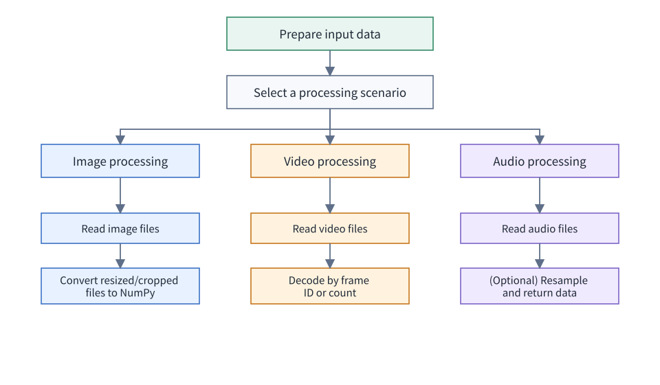
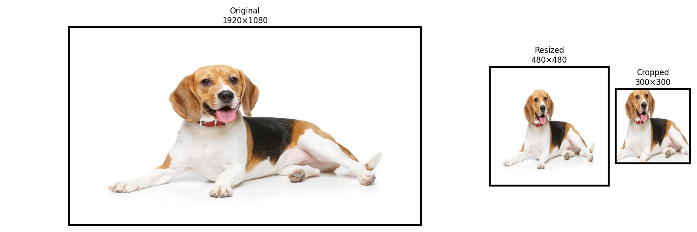
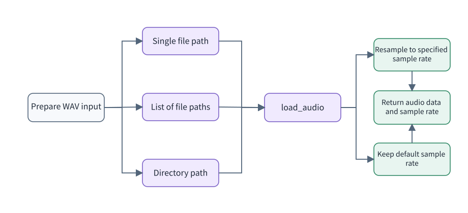

# Examples and Guidance

This document describes how to use the basic preprocessing interfaces of Multimodal SDK in three typical scenarios: image, video, and audio processing. The overall workflow is as follows:



## Preparations

- This document applies to the latest release of Multimodal SDK. Python 3.10 or 3.12 is recommended.
- First complete [Quick Start](../02_quickstart/quickstart.md) or [Installation and Deployment](../03_installation_guide/installation_guide.md), and make sure that `import mm` succeeds.
- The image example requires `matplotlib`, which is used only to display the processing results: `pip3 install matplotlib`.
- Example file permissions must be no more permissive than `640`. JPG/JPEG images, MP4 videos, and WAV audio files are currently supported.

## Image Processing

The following is a simple example for reference. It uses the `Image` class in Multimodal SDK to read an image, resize and crop it, and finally convert the results into standard NumPy arrays to display the effects of these operations.


```python
import mm  # Import the Multimodal SDK package
import matplotlib.pyplot as plt  # Use this only to display images
from matplotlib.patches import Rectangle  # Use this only to display images and draw rectangles

dog_img = mm.Image.open("/home/test.jpg")  # Create an Image object from the actual file using the Multimodal SDK Image class. Make sure that the file permissions are no more permissive than 640.
dog_resized_img = dog_img.resize((480, 480), mm.Interpolation.BICUBIC, mm.DeviceMode.CPU)  # Resize the image using bicubic interpolation in CPU mode
dog_cropped_img = dog_resized_img.crop(100, 100, 300, 300, mm.DeviceMode.CPU)  # Crop the resized image in CPU mode

resized_np = dog_resized_img.numpy()  # Convert the resized image into a NumPy array for subsequent display
cropped_np = dog_cropped_img.numpy()  # Convert the cropped image into a NumPy array for subsequent display
original_dog = dog_img.numpy()  # Convert the original image into a NumPy array for subsequent display

# The following code displays the images
h_orig, w_orig = original_dog.shape[:2]
h_resize, w_resize = resized_np.shape[:2]
h_crop, w_crop = cropped_np.shape[:2]

fig, axes = plt.subplots(1, 3, figsize=(15, 5),
                         gridspec_kw={'width_ratios': [w_orig, w_resize, w_crop]})

# Prepare the data
images = [original_dog, resized_np, cropped_np]
titles = [
    f"Original\n{w_orig}×{h_orig}",
    f"Resized\n{w_resize}×{h_resize}",
    f"Cropped\n{w_crop}×{h_crop}"
]

# Display the images
for ax, img, title in zip(axes, images, titles):
    ax.imshow(img)
    ax.set_title(title)
    ax.axis('off')
    rect = Rectangle((0, 0), 1, 1, transform=ax.transAxes, linewidth=3, edgecolor='black', facecolor='none', clip_on=False)
    ax.add_patch(rect)

plt.tight_layout()
plt.show()
```



## Video Processing

The video decoding interface of Multimodal SDK supports two parameter-setting methods. Choose the appropriate method as needed. `frame_indices` is a `set` that specifies the set of video frame IDs to decode. `sample_num` specifies the target number of frames to sample uniformly when `frame_indices` is empty. If `frame_indices` is not empty, the interface uses the specified frame IDs, and `sample_num` is ignored.

- If a **set of video frame IDs to decode** is provided and the frame IDs are valid, the SDK decodes the specified frames. The returned list of `image` objects has the same length as the frame ID set.
- If the frame ID set is empty, you can specify the **total number of frames to obtain after decoding**. The interface then samples the specified number of frames uniformly from the video. The returned list of `image` objects has the same length as the specified number of frames.


1. Pass the set of frame IDs to decode. The returned list has the same length as the input frame ID set.

   ```python
   from mm import video_decode
   import os

   norm_file_path = "/home/test/xxx.mp4"  # Path of the video file to decode
   os.chmod(norm_file_path, 0o640)  # Modify the file permissions
   frame_indices = {0, 48, 96, 145, 193, 241, 290, 338, 386, 435, 483, 531}
   mm_images = video_decode(norm_file_path, "cpu", frame_indices)
   print(f"mm_images count: {len(mm_images)}")
   ```

   ```text
   mm_images count: 12
   ```

2. Pass an empty set of frame IDs and specify the total number of frames to obtain after decoding. The returned list has the same length as the specified number of frames.

   ```python
   from mm import video_decode
   import os

   norm_file_path = "/home/test/xxx.mp4"  # Path of the video file to decode
   os.chmod(norm_file_path, 0o640)  # Modify the file permissions
   mm_images = video_decode(norm_file_path, "cpu", set(), 10)
   print(f"mm_images count: {len(mm_images)}")
   ```

   ```text
   mm_images count: 10
   ```

## Audio Processing

The following example demonstrates how to load a single audio file and load multiple audio files in batches. Replace the paths with actual WAV files and make sure that the file permissions are no more permissive than `640`.



```python
from mm import load_audio

# Single file loading
single_audio_path = "/path/to/speech.wav"
waveform, sr = load_audio(single_audio_path)
print(f"single audio shape: {waveform.shape}, sample rate: {sr}")

# Batch loading from a file list
audio_file_paths = ["/path/to/audio1.wav", "/path/to/audio2.wav"]
batch_from_filelist = load_audio(audio_file_paths)
print(f"batch count: {len(batch_from_filelist)}")

# Batch loading from a directory
audio_directory = "/path/to/audio_dir"
batch_from_directory = load_audio(audio_directory)
print(f"directory batch count: {len(batch_from_directory)}")
```

To specify a resampling rate, pass the `sr` parameter, for example, `load_audio(single_audio_path, sr=16000)`.

Return values are described as follows:

- When a single audio file is provided, the function returns `(waveform, sr)`, where `waveform` is an audio Tensor and `sr` is the sampling rate.
- When a list of audio files or a directory is provided, the function returns a list of `(waveform, sr)` tuples.

## What to Do Next

| Item | Document |
| ---- | -------- |
| View complete API parameters and constraints | [Function Reference](../05_api/function_reference.md) |
| Troubleshoot common error codes | [Appendix > Error Codes](../06_references/appendix.md#error-codes) |
| Qwen2VL / InternVL2 preprocessing acceleration | [Adapter](../05_api/adapter.md) |
| vLLM inference framework integration | [patcher](../05_api/patcher.md) |
