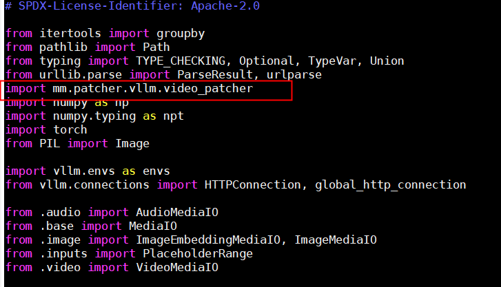
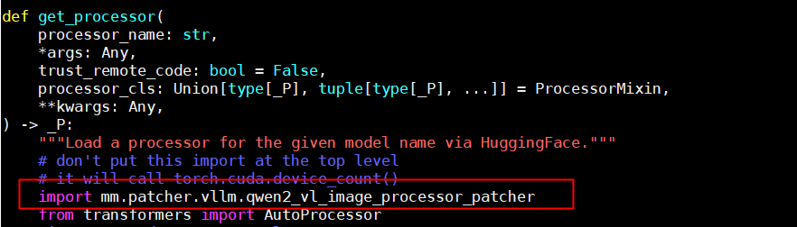
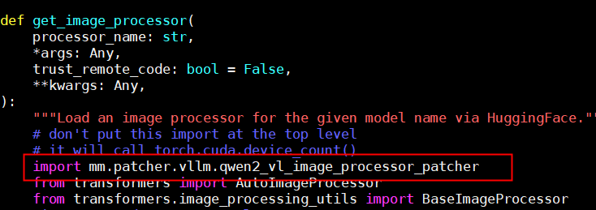
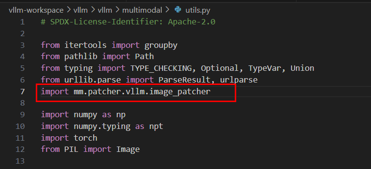
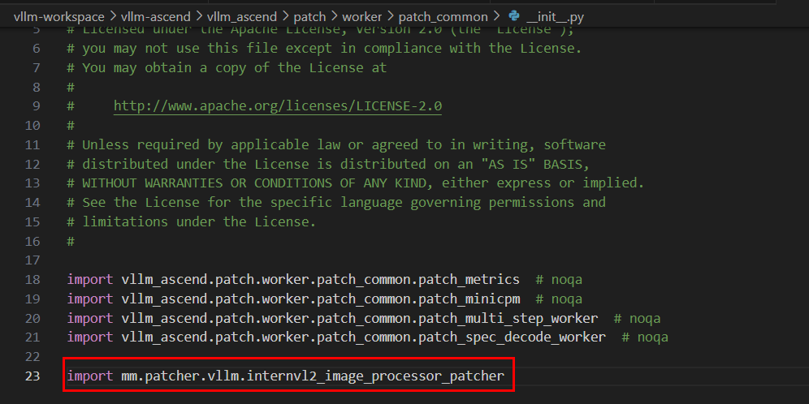

# `patcher`

## Common Prerequisites

Before using any of the patchers below, complete the following preparations:

- Currently, only the **v0.8.5rc1** image obtained from the vllm-ascend community is supported.
- For instructions on installing the image, see the [vllm-ascend documentation](https://vllm-ascend.readthedocs.io/en/v0.8.5rc1/installation.html). When installing the image, select **Using docker** (install from within the container).
- Before using Multimodal SDK capabilities in the image, run the following command:

```bash
export LD_LIBRARY_PATH=/usr/local/Ascend/driver/lib64:/usr/local/Ascend/driver/lib64/common:/usr/local/Ascend/driver/lib64/driver:$LD_LIBRARY_PATH
```

> [!NOTE]
> When using `qwen2_vl_image_processor_patcher` or `internvl2_image_processor_patcher`, ensure that the Transformers version is **4.51.3**. The official Multimodal SDK image already includes this version. If you are using a custom environment, run `python3 -c "import transformers; print(transformers.__version__)"` to verify the version.

This document describes only how to use the image obtained from the community. For other usage methods, you need to locate the files mentioned below and perform the required operations yourself.

---

## `video_patcher`

Accelerates video decoding in vLLM and can significantly improve video file reading and decoding performance.

For prerequisites, see [Common Prerequisites](#common-prerequisites).

**Usage**

Add the following content to the `utils.py` file in the vLLM package. In the image, the file is located at `/vllm-workspace/vllm/vllm/multimodal/utils.py`:

```python
import mm.patcher.vllm.video_patcher
```

Add this line at the beginning of the file, as shown in the following figure.



After adding the line, run the vLLM service and pass video file data to it. If the following message appears, the patcher is enabled:

```text
load_file: Multimodal SDK Video Patcher Enabled!
```

> [!NOTE]
> This acceleration capability currently applies only to video files in `mp4` format. The file permissions must be no more permissive than `640`.

**Example Request**

The following `curl` command sends a video inference request to the OpenAI-compatible `/v1/chat/completions` API provided by the vLLM service. Replace `<host>`, `<port>`, the model path, and the video file path with actual values before running the command. For other vLLM parameters, see the [official vLLM documentation](https://docs.vllm.ai/en/v0.8.5/serving/openai_compatible_server.html#chat-api).

```bash
curl -X POST "http://<host>:<port>/v1/chat/completions" \
  -H "Content-Type: application/json" \
  -d '{
    "model": "/home/Qwen2-VL-7B-Instruct",
    "messages": [
      {
        "role": "user",
        "content": [
          {
            "type": "video_url",
            "video_url": {
              "url": "file:/home/234_chunk_0001.mp4"
            }
          },
          {
            "type": "text",
            "text": "describe the video"
          }
        ]
      }
    ],
    "max_tokens": 100,
    "temperature": 0,
    "top_p": 0.1,
    "stream": false
  }'
```

**Key Parameters**

| Parameter | Description |
| --------- | ----------- |
| `model` | Model path loaded when the vLLM service starts. Must match the `--model` startup parameter. |
| `messages` | List of conversation messages. `role` is typically `user`, and `content` is an array of text and multimodal content. |
| `content[].type` | Multimodal content type. Use `video_url` for video requests and `text` for text prompts. |
| `content[].video_url.url` | Local video path with the `file:` protocol prefix. The video must be in `mp4` format, and the file permissions must be no more permissive than `640` (see the note above). |
| `content[].text` | Text prompt for the video. |
| `max_tokens` | Maximum number of tokens to generate in the response. |
| `temperature` / `top_p` | Sampling parameters that control output randomness. Setting `temperature` to `0` and using a small `top_p` produces more stable output. |
| `stream` | Specifies whether to return the result in streaming mode. `false` means that the complete response is returned at once. |

---

## `qwen2_vl_image_processor_patcher`

Accelerates image and video preprocessing in vLLM when using Qwen2-VL models and can significantly reduce preprocessing latency compared with Transformers.

For prerequisites, see [Common Prerequisites](#common-prerequisites), including the Transformers 4.51.3 requirement.

**Usage**

Add the following content to the `processor.py` file in the vLLM package. In the image, the file is located at `/vllm-workspace/vllm/vllm/transformers_utils/processor.py`:

```python
import mm.patcher.vllm.qwen2_vl_image_processor_patcher
```

Add the import statement at the following two locations:

- In the `get_processor` function, add it on the line before `from transformers import AutoProcessor`. If you are using a container, this is around lines 62–63, as shown in the following figure.

  

- In the `get_image_processor` function, add it on the line before `from transformers import AutoImageProcessor`. If you are using a container, this is around lines 174–175, as shown in the following figure.

  

After adding the lines, run the vLLM service. If the following message appears when you send a normal request, the Qwen2-VL image and video preprocessing acceleration feature is enabled:

```text
get_image_processor_class_from_name: Multimodal SDK Qwen2 VL Image Patcher Enabled!
```

**Example Request**

The following `curl` commands send inference requests to the OpenAI-compatible `/v1/chat/completions` API provided by the vLLM service. Replace `<host>`, `<port>`, the model path, and the media file path with actual values before running the commands. For other vLLM parameters, see the [official vLLM documentation](https://docs.vllm.ai/en/v0.8.5/serving/openai_compatible_server.html#chat-api).

**Video Processing Example**

```bash
curl -X POST "http://<host>:<port>/v1/chat/completions" \
  -H "Content-Type: application/json" \
  -d '{
    "model": "/home/Qwen2-VL-7B-Instruct",
    "messages": [
      {
        "role": "user",
        "content": [
          {
            "type": "video_url",
            "video_url": {
              "url": "file:/home/234_chunk_0001.mp4"
            }
          },
          {
            "type": "text",
            "text": "describe the video"
          }
        ]
      }
    ],
    "max_tokens": 100,
    "temperature": 0,
    "top_p": 0.1,
    "stream": false
  }'
```

**Image Processing Example**

```bash
curl -X POST "http://<host>:<port>/v1/chat/completions" \
  -H "Content-Type: application/json" \
  -d '{
    "model": "/home/Qwen2-VL-7B-Instruct",
    "messages": [
      {
        "role": "user",
        "content": [
          {
            "type": "image_url",
            "image_url": {
              "url": "file:/home/test.jpg"
            }
          },
          {
            "type": "text",
            "text": "describe the image"
          }
        ]
      }
    ],
    "max_tokens": 100,
    "temperature": 0,
    "top_p": 0.1,
    "stream": false
  }'
```

**Key Parameters**

| Parameter | Description |
| --------- | ----------- |
| `model` | Model path loaded when the vLLM service starts. Must match the `--model` startup parameter. |
| `messages` | List of conversation messages. `role` is typically `user`, and `content` is an array of text and multimodal content. |
| `content[].type` | Multimodal content type. Use `video_url` for video requests, `image_url` for image requests, and `text` for text prompts. |
| `content[].video_url.url` | Local video path with the `file:` protocol prefix. |
| `content[].image_url.url` | Local image path with the `file:` protocol prefix. |
| `content[].text` | Text prompt for the video or image. |
| `max_tokens` | Maximum number of tokens to generate in the response. |
| `temperature` / `top_p` | Sampling parameters that control output randomness. Setting `temperature` to `0` and using a small `top_p` produces more stable output. |
| `stream` | Specifies whether to return the result in streaming mode. `false` means that the complete response is returned at once. |

---

## `image_patcher`

Accelerates image decoding in vLLM and can significantly improve image file reading and decoding performance.

For prerequisites, see [Common Prerequisites](#common-prerequisites).

**Usage**

Add the following content to the `utils.py` file in the vLLM package. In the image, the file is located at `/vllm-workspace/vllm/vllm/multimodal/utils.py`:

```python
import mm.patcher.vllm.image_patcher
```

Add this line at the beginning of the file, as shown in the following figure.



After adding the line, run the vLLM service and pass image file data to it. If the following message appears, the patcher is enabled:

```text
load_file: Multimodal SDK Image Patcher Enabled!
```

> [!NOTE]
> This acceleration capability currently applies only to JPEG images. The file extension must be `jpg` or `jpeg`, and the file permissions must be no more permissive than `640`.

**Example Request**

The following `curl` command sends an image inference request to the OpenAI-compatible `/v1/chat/completions` API provided by the vLLM service. Replace `<host>`, `<port>`, the model path, and the image file path with actual values before running the command. For other vLLM parameters, see the [official vLLM documentation](https://docs.vllm.ai/en/v0.8.5/serving/openai_compatible_server.html#chat-api).

```bash
curl -X POST "http://<host>:<port>/v1/chat/completions" \
  -H "Content-Type: application/json" \
  -d '{
    "model": "/home/models/internVL2",
    "messages": [
      {
        "role": "user",
        "content": [
          {
            "type": "image_url",
            "image_url": {
              "url": "file:/home/test.jpg"
            }
          },
          {
            "type": "text",
            "text": "describe the image"
          }
        ]
      }
    ],
    "max_tokens": 100,
    "temperature": 0.1,
    "top_p": 0.1,
    "stream": false
  }'
```

**Key Parameters**

| Parameter | Description |
| --------- | ----------- |
| `model` | Model path loaded when the vLLM service starts. Must match the `--model` startup parameter. |
| `messages` | List of conversation messages. `role` is typically `user`, and `content` is an array of text and multimodal content. |
| `content[].type` | Multimodal content type. Use `image_url` for image requests and `text` for text prompts. |
| `content[].image_url.url` | Local image path with the `file:` protocol prefix. The image must be in JPEG format, the file extension must be `jpg` or `jpeg`, and the file permissions must be no more permissive than `640` (see the note above). |
| `content[].text` | Text prompt for the image. |
| `max_tokens` | Maximum number of tokens to generate in the response. |
| `temperature` / `top_p` | Sampling parameters that control output randomness. |
| `stream` | Specifies whether to return the result in streaming mode. `false` means that the complete response is returned at once. |

## Common Issues and Troubleshooting

| Symptom | Resolution |
| ------- | ---------- |
| The `Multimodal SDK ... Patcher Enabled!` message does not appear. | Verify that the corresponding `import mm.patcher.vllm...` statement has been added to the file and location specified in this document, and restart the vLLM service. |
| Image or video reading fails. | Verify that the file path uses the `file:` protocol prefix, the file format meets the requirements of the current patcher, and the file permissions are no more permissive than `640`. |
| The Transformers version does not match the requirement. | Run `python3 -c "import transformers; print(transformers.__version__)"` in the container and verify that the version is 4.51.3. |
| The issue cannot be located. | Check the vLLM service logs and see [Appendix > Error Codes](../06_references/appendix.md#error-codes) to troubleshoot issues such as incorrect file permissions, paths, and formats. |

---

## `internvl2_image_processor_patcher`

Accelerates image processing in vLLM when using InternVL2 models.

For prerequisites, see [Common Prerequisites](#common-prerequisites), including the Transformers 4.51.3 requirement.

**Usage**

Add the following content to a file in the vllm-ascend package. In the image, the file is located at `/vllm-workspace/vllm-ascend/vllm_ascend/patch/worker/patch_common/__init__.py`:

```python
import mm.patcher.vllm.internvl2_image_processor_patcher
```

Add it at the location shown in the following figure:



After adding the line, run the vLLM service. If the following message appears when you send a normal request, the multimodal InternVL2 image preprocessing acceleration feature is enabled:

```text
_images_to_pixel_values_lst: Multimodal SDK InternVL2 Image Patcher Enabled!
```

**Example Request**

The following `curl` command sends an image inference request to the OpenAI-compatible `/v1/chat/completions` API provided by the vLLM service. Replace `<host>`, `<port>`, the model path, and the image file path with actual values before running the command. For other vLLM parameters, see the [official vLLM documentation](https://docs.vllm.ai/en/v0.8.5/serving/openai_compatible_server.html#chat-api).

```bash
curl -X POST "http://<host>:<port>/v1/chat/completions" \
  -H "Content-Type: application/json" \
  -d '{
    "model": "/home/models/internVL2",
    "messages": [
      {
        "role": "user",
        "content": [
          {
            "type": "image_url",
            "image_url": {
              "url": "file:/home/test.jpg"
            }
          },
          {
            "type": "text",
            "text": "describe the image"
          }
        ]
      }
    ],
    "max_tokens": 100,
    "temperature": 0.1,
    "top_p": 0.1,
    "stream": false
  }'
```

**Key Parameters**

| Parameter | Description |
| --------- | ----------- |
| `model` | Model path loaded when the vLLM service starts. Must match the `--model` startup parameter. |
| `messages` | List of conversation messages. `role` is typically `user`, and `content` is an array of text and multimodal content. |
| `content[].type` | Multimodal content type. Use `image_url` for image requests and `text` for text prompts. |
| `content[].image_url.url` | Local image path with the `file:` protocol prefix. |
| `content[].text` | Text prompt for the image. |
| `max_tokens` | Maximum number of tokens to generate in the response. |
| `temperature` / `top_p` | Sampling parameters that control output randomness. |
| `stream` | Specifies whether to return the result in streaming mode. `false` means that the complete response is returned at once. |
