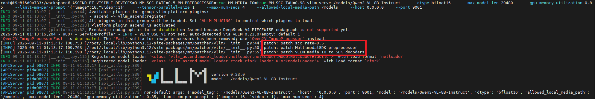

# patcher

> Introduction: This section describes the feature switches provided by the Multimodal SDK in vLLM. By setting the environment variables below, you can enable capabilities such as SCC visual token compression and preprocessing acceleration **without modifying the vLLM source code**.

---

## Common Prerequisites

Before using any of these features, complete the following preparations:

- Install the Multimodal SDK.

> The Multimodal SDK is automatically loaded as a vLLM plugin (vLLM scans for the `mm.patcher.vllm` entry point at startup).

---

## Environment Variables

All variables in the table below are read once by `mm.patcher.vllm.patch()` when vLLM starts, and determine whether the corresponding monkey patch is activated.

| Environment Variable | Type | Value Range | Default | Description |
| --- | --- | --- | --- | --- |
| `MM_SCC_RATE` | float | `(0, 1]` | `1.0` | SCC visual token compression ratio. `1.0` disables compression; the smaller the value, the fewer tokens retained after compression and the faster the inference, but accuracy may degrade. |
| `MM_SCC_TAU` | float | `(0, 1]` | `0.95` | Cosine similarity threshold for SCC partitioning. A higher value means stricter merging criteria, less information loss, and weaker compression gains. |
| `MM_SCC_EPSILON` | float | `(0, 1)` | `0.05` | Sampling error tolerance for approximate Union-Find, used only in the CPU fallback path. |
| `MM_SCC_MAX_TOKENS_PER_ITEM` | int | `[0, 65536]` | `8192` | Maximum number of tokens per sample. Samples exceeding this limit are **excluded from SCC compression** and sent directly to the LLM. `0` means no limit. |
| `MM_PREPROCESSOR` | bool | `true` / `false` | `false` | Enable the SDK's image/video preprocessing acceleration (via `mm.core.processor.resize_and_normalize`). |
| `MM_MEDIA_IO` | bool | `true` / `false` | `false` | Enable the SDK's video/image decoding acceleration. |

If any variable is set to an invalid value, the Multimodal SDK prints a warning in the vLLM log and falls back to the default value; vLLM startup will not fail.

### Disabling SDK Acceleration

- **Disable SCC visual token compression**: `MM_SCC_RATE=1.0` (or leave unset to use the default).
- **Disable preprocessing acceleration**: `MM_PREPROCESSOR=false` (or leave unset).
- **Disable media decoding acceleration**: `MM_MEDIA_IO=false` (or leave unset).

Disabling does not affect vLLM service startup; the corresponding monkey patch is simply not injected.

---

## Supported Models

Once the environment variables above are set, SCC and preprocessing acceleration take effect automatically on the following models (when vLLM loads the corresponding model class, the Multimodal SDK injects the monkey patches on demand):

| Model | SCC Visual Token Compression | Preprocessing Acceleration | Recommended `MM_SCC_RATE` |
| --- | --- | --- | --- |
| **Qwen2.5-VL-7B-Instruct** | ✓ | ✓ | 0.5 |
| **Qwen3-VL-8B-Instruct** | ✓ | ✓ | 0.6 |
| **Qwen3.6-35B-A3B** | ✓ | ✓ | 0.7 |
| **Qwen3.6-27B** | ✓ | ✓ | 0.6 |

Other models are not involved in SCC / preprocessing patches and are therefore unaffected.

> **Media decoding acceleration (`MM_MEDIA_IO`) is model-agnostic**: this patch replaces vLLM's `VideoMediaIO` / `ImageMediaIO` media loading entry points and acts on the media decoding layer rather than the model side, so it takes effect for **all models**, not just those listed in the table above.

---

## Version and Branch Mapping

Historically, the Multimodal SDK has provided different patches for different versions of **vllm-ascend**. The vLLM entry APIs targeted by these patches are mutually incompatible, so you need to check the corresponding branch.
This section only describes the supported models and accelerated components per version; for details on SCC / preprocessing operations, see [Environment Variables](#environment-variables) and [Starting vLLM](#starting-vllm) above.

| vllm-ascend Version | Branch | Supported Models | Accelerated Components |
| --- | --- | --- | --- |
| **v0.23.0** (default for this document) | `master` `release/v26.2.0` | Qwen2.5-VL · Qwen3-VL · Qwen3.5 · Qwen3.6 | SCC visual token compression (limited to the models above); image/video preprocessing acceleration (limited to the models above); video/image decoding acceleration (all models) |
| **v0.8.5rc1** | `branch_v26.0.0` · `branch_v26.1.0` | Qwen2.5-VL · InternVL2 | Video decoding acceleration; Qwen2.5-VL / InternVL2 image preprocessing acceleration |

> **Scope note**: This document describes **only** vllm-ascend v0.23.0 on the `master` branch; the legacy patches on `branch_v26.x` use a different integration approach — see the `patcher.md` document on the corresponding branch for details.

---

## Starting vLLM

After setting the environment variables, **just use the native `vllm serve` command** — no additional SDK-side arguments are required. For example, to run Qwen3-VL-8B-Instruct with SCC + preprocessing acceleration enabled:

```bash
MM_SCC_RATE=0.5 \
MM_SCC_TAU=0.95 \
MM_SCC_EPSILON=0.05 \
MM_SCC_MAX_TOKENS_PER_ITEM=8192 \
MM_PREPROCESSOR=true \
MM_MEDIA_IO=true \
vllm serve /models/Qwen3-VL-8B-Instruct \
    --host 0.0.0.0 \
    --port 9000
```

### Verifying That Patches Are Active

In the early portion of the startup log, the presence of any of the following lines indicates that the corresponding patch has been loaded:

| Log Keyword | Meaning |
| --- | --- |
| `patch scc rate=<value>` | SCC visual token compression injected (`MM_SCC_RATE < 1.0`) |
| `patch MultimodalSDK preprocessor` | Image/video preprocessing acceleration injected (`MM_PREPROCESSOR=true`) |
| `patch vLLM media IO to SDK decoders` | Media decoding acceleration injected (`MM_MEDIA_IO=true`) |

As shown in the figure below, the startup log contains the line indicating that SCC visual token compression has been injected (`MM_SCC_RATE < 1.0`).



---

## File Requirements and Request Examples for Media Decoding Acceleration

With `MM_MEDIA_IO=true` enabled, vLLM's video/image decoding uniformly goes through the SDK decoders (replacing `VideoMediaIO` / `ImageMediaIO`), which imposes the following requirements on media files in requests:

| Media Type | Supported Formats | Notes |
| --- | --- | --- |
| Image | jpg / jpeg | Other formats (png / bmp / webp, etc.) are not supported by the SDK decoders; such requests will return an error. |
| Video | mp4 | Other containers (avi / mkv / mov, etc.) are not supported by the SDK decoders; such requests will return an error. |

Additional notes:

- Using `file://` requires specifying `--allowed-local-media-path` when starting vLLM to add the media file directory to the whitelist; otherwise vLLM will refuse to access local files. For example, if media files are stored under `/data`: `--allowed-local-media-path /data`.
- Media file permissions should not be more permissive than 640.
- The patch layer validates file existence; if the file does not exist, an error is raised directly without falling back to native decoding.

### Image Request Example

Send an image request via the OpenAI-compatible API, with `image_url` using the `file://` protocol pointing to a server-side local jpg/jpeg file:

```bash
curl http://localhost:9000/v1/chat/completions \
    -H "Content-Type: application/json" \
    -d '{
        "model": "/models/Qwen3-VL-8B-Instruct",
        "messages": [
            {
                "role": "user",
                "content": [
                    {"type": "image_url", "image_url": {"url": "file:///data/images/dog.jpg"}},
                    {"type": "text", "text": "Describe the content of this image"}
                ]
            }
        ]
    }'
```

### Video Request Example

Video requests use the `video_url` type, likewise pointing to a server-side local mp4 file via the `file://` protocol:

```bash
curl http://localhost:9000/v1/chat/completions \
    -H "Content-Type: application/json" \
    -d '{
        "model": "/models/Qwen3-VL-8B-Instruct",
        "messages": [
            {
                "role": "user",
                "content": [
                    {"type": "video_url", "video_url": {"url": "file:///data/videos/demo.mp4"}},
                    {"type": "text", "text": "Describe the content of this video"}
                ]
            }
        ]
    }'
```

---

## Common Tuning Tips

| Scenario | Recommended Adjustment |
| --- | --- |
| Noticeable accuracy drop | Tighten `MM_SCC_TAU` (e.g., `0.98`), or increase `MM_SCC_RATE` moderately (e.g., `0.7`). |
| More aggressive compression desired | Lower `MM_SCC_RATE` (e.g., `0.3`). |

---

## References

- `MultimodalSDK/source/mm/patcher/vllm/__init__.py` — plugin entry point and switch logic
- `MultimodalSDK/source/mm/patcher/vllm/constants.py` — environment variable definitions and validation
- `MultimodalSDK/source/mm/patcher/vllm/patch_media_io.py` — media decoding acceleration patch (`VideoMediaIO` / `ImageMediaIO`)
- `MultimodalSDK/source/mm/core/scc/compressor.py` — SCC visual token compression algorithm
- `MultimodalSDK/source/mm/core/processor.py` — `resize_and_normalize` implementation
