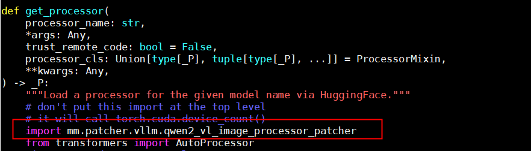

# `patcher`

## `video_patcher`

This patch accelerates vLLM video decoding and can greatly improve video file reading and decoding performance.

>[!CAUTION] Note
>
>- When you use this patch, only the 0.8.5.rc1 image from the vllm-ascend community is currently supported.
>- For installation instructions for the image, see [vllm-ascend](https://vllm-ascend.readthedocs.io/en/v0.8.5rc1/installation.html). When you install it, select **Using docker**.
>- To use Multimodal SDK capabilities in the image, run the following command first:
>
>     ```bash
>     export LD_LIBRARY_PATH=/usr/local/Ascend/driver/lib64:/usr/local/Ascend/driver/lib64/common:/usr/local/Ascend/driver/lib64/driver:$LD_LIBRARY_PATH
>     ```

**Usage**

This document only describes how to use the image obtained from the community. For other usage methods, you need to locate the files mentioned below and perform the required operations yourself.

You need to add the following content to the `utils.py` file in the `vllm` package. In the image, the file is located at `/vllm-workspace/vllm/vllm/multimodal/utils.py`.

```python
import mm.patcher.vllm.video_patcher
```

Add the line at the beginning of the file. The following figure shows an example.


After you add the line, when you run the vLLM service and pass video file data to it, the following message indicates success:

```ColdFusion
load_file: Multimodal SDK Video Patcher Enabled!
```

>[!CAUTION] Note
>This acceleration capability currently applies only to video files. The format must be `mp4`, and the file permissions must not be higher than 640.

**Example Request Body**

The following example request body cannot be copied and used directly. For other vLLM parameters, see the [official vLLM documentation](https://docs.vllm.ai/en/v0.8.5/serving/openai_compatible_server.html#chat-api).

Send the request body to the OpenAI-compatible API exposed by vLLM. This document uses `/v1/chat/completion`.

```json
{
  "model": "/home/Qwen2-VL-7B-Instruct",  // Model path
  "messages": [
    {
      "role": "user",
      "content": [
        {
          "type": "video_url",
          "video_url": {
            "url": "file:/home/234_chunk_0001.mp4"
          }  // Local path of the video file
        },
        {
          "type": "text",
          "text": "describe the video"
        }  // Text prompt entered by the user
      ]
    }
  ],
  "max_tokens": 100,   // Maximum number of output tokens
  "temperature": 0,    // Controls the randomness of generation. Lower values are more deterministic
  "top_p": 0.1,        // Nucleus sampling parameter
  "stream": false      // Whether to use streaming output
}
```

## `qwen2_vl_image_processor_patcher`

This patch accelerates image and video preprocessing when vLLM uses the Qwen2VL model. Compared with transformers, it can significantly reduce preprocessing latency.

>[!CAUTION] Note
>
>- When you use this patch, only the 0.8.5.rc1 image from the vllm-ascend community is currently supported, and you must ensure that the transformers version is 4.51.3.
>- For installation instructions for the image, see [vllm-ascend](https://vllm-ascend.readthedocs.io/en/v0.8.5rc1/installation.html). When you install it, select **Using docker**.
>- To use Multimodal SDK capabilities in the image, run the following command first:
>
>     ```bash
>     export LD_LIBRARY_PATH=/usr/local/Ascend/driver/lib64:/usr/local/Ascend/driver/lib64/common:/usr/local/Ascend/driver/lib64/driver:$LD_LIBRARY_PATH
>     ```

**Usage**

This document only describes how to use the image obtained from the community. For other usage methods, you need to locate the files mentioned below and perform the required operations yourself.

You need to add the following content to the `processor.py` file in the `vllm` package. In the image, the file is located at `/vllm-workspace/vllm/vllm/transformers_utils/processor.py`.

```python
import mm.patcher.vllm.qwen2_vl_image_processor_patcher
```

You need to add the content in the following two locations:

Add it on the line before `from transformer import AutoProcessor` in the `get_processor` function. If you use a container, this is line 62 or 63, as shown in the following figure.



Add it on the line before `from transformer import AutoImageProcessor` in the `get_image_processor` function. If you use a container, this is line 174 or 175, as shown in the following figure.


After you add the line, when you run the vLLM service normally, if the following message appears after a normal conversation, it indicates that the multimodal Qwen2VL image and video preprocessing acceleration feature is in use:

```ColdFusion
get_image_processor_class_from_name: Multimodal SDK Qwen2 VL Image Patcher Enabled!
```

**Example Request Body**

The following video example request body cannot be copied and used directly. For other vLLM parameters, see the [official vLLM documentation](https://docs.vllm.ai/en/v0.8.5/serving/openai_compatible_server.html#chat-api).

Send the request body to the OpenAI-compatible API exposed by vLLM. This document uses `/v1/chat/completions`.

```json
{
  "model": "/home/Qwen2-VL-7B-Instruct",  // Model path
  "messages": [
    {
      "role": "user",
      "content": [
        {
          "type": "video_url",
          "video_url": {
            "url": "file:/home/234_chunk_0001.mp4"
          }  // Local path of the video file
        },
        {
          "type": "text",
          "text": "describe the video"
        }  // Text prompt entered by the user
      ]
    }
  ],
  "max_tokens": 100,   // Maximum number of output tokens
  "temperature": 0,    // Controls the randomness of generation. Lower values are more deterministic
  "top_p": 0.1,        // Nucleus sampling parameter
  "stream": false      // Whether to use streaming output
}
```

The following is an image example request body. It cannot be copied and used directly. For other vLLM parameters, see the [official vLLM documentation](https://docs.vllm.ai/en/v0.8.5/serving/openai_compatible_server.html#chat-api).

```json
{
  "model": "/home/Qwen2-VL-7B-Instruct",  // Model path
  "messages": [
    {
      "role": "user",
      "content": [
        {
          "type": "image_url",
          "image_url": {
            "url": "file:/home/test.jpg"
          }  // Local path of the image file
        },
        {
          "type": "text",
          "text": "describe the image"
        }  // Text prompt entered by the user
      ]
    }
  ],
  "max_tokens": 100,   // Maximum number of output tokens
  "temperature": 0,    // Controls the randomness of generation. Lower values are more deterministic
  "top_p": 0.1,        // Nucleus sampling parameter
  "stream": false      // Whether to use streaming output
}
```

## `image_patcher`

This patch accelerates vLLM image decoding and can greatly improve image file reading and decoding performance.

>[!CAUTION] Note
>
>- When you use this patch, only the 0.8.5.rc1 image from the vllm-ascend community is currently supported.
>- For installation instructions for the image, see [vllm-ascend](https://vllm-ascend.readthedocs.io/en/v0.8.5rc1/installation.html). When you install it, select **Using docker**.
>- To use Multimodal SDK capabilities in the image, run the following command first:
>
>     ```bash
>     export LD_LIBRARY_PATH=/usr/local/Ascend/driver/lib64:/usr/local/Ascend/driver/lib64/common:/usr/local/Ascend/driver/lib64/driver:$LD_LIBRARY_PATH
>     ```

**Usage**

This document only describes how to use the image obtained from the community. For other usage methods, you need to locate the files mentioned below and perform the required operations yourself.

You need to add the following content to the `utils.py` file in the `vllm` package. In the image, the file is located at `/vllm-workspace/vllm/vllm/multimodal/utils.py`.

```python
import mm.patcher.vllm.image_patcher
```

Add the line at the beginning of the file. The following figure shows an example.


After you add the line, when you run the vLLM service and pass image file data to it, the following message indicates success:

```ColdFusion
load_file: Multimodal SDK Image Patcher Enabled!
```

>[!CAUTION] Note
>This acceleration capability currently applies only to JPEG images. The file extension must be `jpg` or `jpeg`, and the file permissions must not be higher than 640.

**Example Request Body**

The following example request body cannot be copied and used directly. For other vLLM parameters, see the [official vLLM documentation](https://docs.vllm.ai/en/v0.8.5/serving/openai_compatible_server.html#chat-api).

Send the request body to the OpenAI-compatible API exposed by vLLM. This document uses `/v1/chat/completion`.

```json
{
  "model": "/home/models/internVL2",  // Model path
  "messages": [{
    "role":"user",
    "content":[
    {"type": "image_url", "image_url": {"url": "file:/home/test.jpg"}}, // Local image path
        {"type": "text", "text": "describe the image"}
      ]
    }],
"max_tokens": 100, // Maximum number of output tokens
"temperature": 0.1, // Controls the randomness of generation. Lower values are more deterministic
"top_p":0.1, // Nucleus sampling parameter
"stream": false // Whether to use streaming output
}
```

## `internvl2_image_processor_patcher`

This patch provides acceleration for image processing when vLLM uses the InternVL2 model.

>[!CAUTION] Note
>
>- When you use this patch, only the 0.8.5.rc1 image from the vllm-ascend community is currently supported, and you must ensure that the transformers version is 4.51.3.
>- For installation instructions for the image, see [vllm-ascend](https://vllm-ascend.readthedocs.io/en/v0.8.5rc1/installation.html). When you install it, select **Using docker**.
>- To use Multimodal SDK capabilities in the image, run the following command first:
>
>     ```bash
>     export LD_LIBRARY_PATH=/usr/local/Ascend/driver/lib64:/usr/local/Ascend/driver/lib64/common:/usr/local/Ascend/driver/lib64/driver:$LD_LIBRARY_PATH
>     ```

**Usage**

This document only describes how to use the image obtained from the community. For other usage methods, you need to locate the files mentioned below and perform the required operations yourself.

You need to add the following content to a file in the vllm-ascend package. In the image, the file is located at `/vllm-workspace/vllm-ascend/vllm_ascend/patch/worker/patch_common/__init__.py`.

```python
import mm.patcher.vllm.internvl2_image_processor_patcher
```

Add it at the location shown in the following figure:


After you add the line, when you run the vLLM service normally, if the following message appears after a normal conversation, it indicates that the multimodal Qwen2VL image and video preprocessing acceleration feature is in use:

```ColdFusion
_images_to_pixel_values_lst: Multimodal SDK InternVL2 Image Patcher Enabled!
```

**Example Request Body**

The following image example request body cannot be copied and used directly. For other vLLM parameters, see the [official vLLM documentation](https://docs.vllm.ai/en/v0.8.5/serving/openai_compatible_server.html#chat-api).

```json
{
  "model": "/home/models/internVL2",  // Model path
  "messages": [{
    "role":"user",
    "content":[
     {"type": "image_url", "image_url": {"url": "file:/home/test.jpg"}}, // Local image path
        {"type": "text", "text": "describe the image"}
      ]
    }],
"max_tokens": 100, // Maximum number of output tokens
"temperature": 0.1, // Controls the randomness of generation. Lower values are more deterministic
"top_p":0.1, // Nucleus sampling parameter
"stream": false // Whether to use streaming output
}
```
