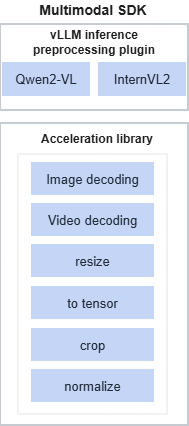

# Introduction

Multimodal inference workflows need to process large volumes of complex data. Multimodal SDK accelerates LLM preprocessing by providing a set of high-performance interfaces optimized for Ascend devices.

- It includes common preprocessing operations such as image and video loading and decoding, resizing, and cropping.
- It supports conversion between multiple open-source data structures and accelerator library data structures, which makes it easy to use and quick to port.

**User Guide**

| Scenario | Document |
| -- | -- |
| Docker quick experience (about 5 minutes) | [Quick Start](./quickstart.md) |
| Native installation on host | [Installation Guide](./installation_guide.md) |
| Already installed, check API | [Python API Reference](./api/README.md) |

# Software Architecture

The software architecture of Multimodal SDK is shown in [Figure 1](#fig92951326193419).

**Figure 1** software architecture of Multimodal SDK

**Table 1** modules in the architecture

|Module|Description|
|--|--|
|vLLM framework preprocessing plugin|Provides acceleration when you use vLLM for LLM inference. <ul><li>Qwen2-VL: Provides accelerated image and video preprocessing when you use the Qwen2-VL model. Compared with preprocessing in Transformers, latency is greatly reduced.</li><li>InternVL2: Provides accelerated image and video preprocessing when you use the InternVL2 model.</li></ul>|
|Acceleration library|Provides a set of high-performance image and tensor processing interfaces.|

# Supported Hardware and OSs

|Product Series|Product Model|OS Version|
|--|--|--|
|Atlas A2 inference products|Atlas 800I A2 inference server|Ubuntu 22.04|
