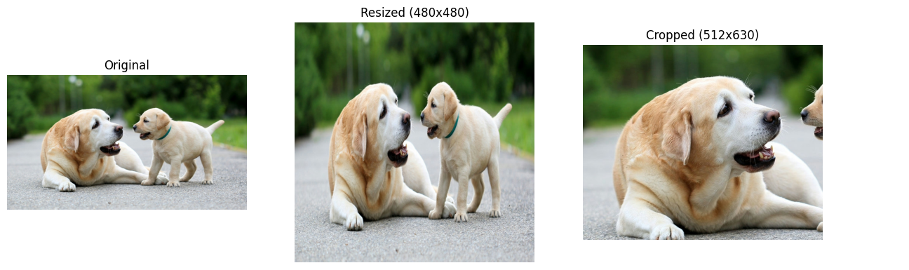
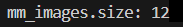
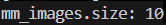

# Examples and Guidance

## Image Processing

The following is a simple example for reference. It reads an image using Multimodal SDK, resizes and crops it, and then converts it into a standard NumPy array to show the effect of these operations.

```python
import mm # Import the Multimodal SDK package
import matplotlib.pyplot as plt # Use this only for image display

dog_img = mm.Image.open("/home/test.jpg") # Construct an Image object from a real file with the Multimodal Image class, and ensure that the file permissions do not exceed 640
dog_resized_img = dog_img.resize((480,480), mm.Interpolation.BICUBIC, mm.DeviceMode.CPU) # Resize the constructed image
dog_cropped_img = dog_img.crop(100, 100, 512, 630, mm.DeviceMode.CPU) # Crop the constructed image

resized_np = dog_resized_img.numpy() # Convert the resized image into a NumPy array for later display
cropped_np = dog_cropped_img.numpy() # Convert the cropped image into a NumPy array for later display
original_dog = dog_img.numpy() # Convert the original image into a NumPy array for later display

# The following code displays the images
plt.figure(figsize=(15, 5))

plt.subplot(1, 3, 1)
plt.title("Original")
plt.imshow(original_dog)
plt.axis("off")

plt.subplot(1, 3, 2)
plt.title("Resized (480x480)")
plt.imshow(resized_np)
plt.axis("off")

plt.subplot(1, 3, 3)
plt.title("Cropped (512x630)")
plt.imshow(cropped_np)
plt.axis("off")

plt.show()
```



## Video Processing

The video decoding interface in Multimodal SDK provides two custom parameters for you to choose from. In order of priority, if the requested frame IDs are valid, the decoder first uses those frame IDs. The returned list of video frame image objects has the same length as the input frame ID list. If the frame ID list is empty, pass the expected total number of frames to obtain after decoding. The returned list of decoded video frame image objects has the same length as the expected total number of frames.

1. Pass the set of frame IDs to decode as input. The returned list has the same length as the input frame ID set.

    ```python
    from mm import video_decode
    import os
    norm_file_path = "/home/test/xxx.mp4" # File path of the video to decode
    os.chmod(norm_file_path, 0o640) # Modify the permissions
    mm_images = video_decode(norm_file_path, "cpu", [0, 48, 96, 145, 193, 241, 290, 338, 386, 435, 483, 531], 10)
    print(f"mm_images.size: {len(mm_images)}")
    ```

    

2. Pass an empty frame ID list and the expected total number of frames to obtain after decoding. The returned list has the same length as the expected total number of frames.

    ```python
    from mm import video_decode
    import os
    norm_file_path = "/home/test/xxx.mp4" # File path of the video to decode
    os.chmod(norm_file_path, 0o640) # Modify the permissions
    mm_images = video_decode(norm_file_path, "cpu", [], 10)
    print(f"mm_images.size: {len(mm_images)}")
    ```

    
