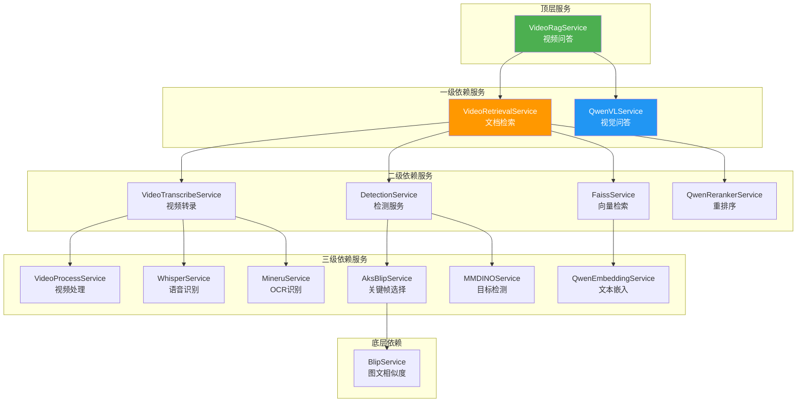
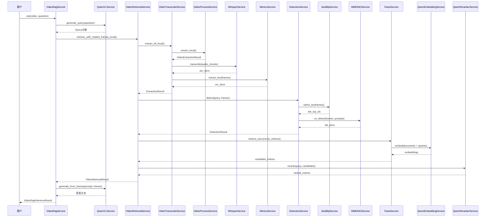

<!-- markdownlint-disable MD041 -->
**状态 (Status):** Draft
**作者 (Authors):** @dd5577854
**创建日期 (Created):** 2026-05-06
**更新日期 (Updated):** 2026-05-06
**相关 Issue/PR:** [#4](https://gitcode.com/Ascend/MultimodalSDK/issues/4)

---

# 1. 概述

## 1.1 简介

教育、安全等场景会分析大量的图像数据，直接依赖模型对整段视频进行端到端理解在计算成本、时序建模难度和响应延迟上都难以落地，因此需要支持自动寻优和多尺度重采样能力，提供高效的多模态分析处理方案。

## 1.2 动机

本提案通关键帧筛选及多模态RAG重采样对长视频进行预处理与精炼，实现内容的自动寻优与多尺度重采样。核心价值在于降低大模型处理粒度与成本——只将高信息密度的关键片段送入模型，而非全量视频。

## 1.3 目标

在指定数据集、场景和模型的前提下，对比直接使用视觉模型做推理，达成推理精度提升20%，推理速度提升50%。非指定数据集和场景下的精度和性能不做保证。

# 2. 用例分析

本提案旨在通过关键帧筛选及多模态RAG重采样，提升视频理解及问答场景下的精度及性能，测试及验收时在下述两个数据集上运行端到端流程，对比直接使用视觉模型做推理，达成精度提升20%、速度提升50%。

**北航课堂视频理解用例（非公开数据集）**

1. 包含7视频/720p/无字幕/5~50min/70QA/主观题
2. 包含Definition/Process/Logic/Detail类别问题

**VideoMME-Long用例（开源数据集）**

1. 包含300视频/720p/无字幕/30~60min/900QA/单选题
2. 包含Action Recognition/Attribute Recognition/Object Recogntion/Temporal Ordering/Causal Reasoning/Audio-Visial Correspondence/OCR/Summary/Intent Understanding/Calculation/Information Synthesis/Spatial Relationship类别问题

# 3. 方案设计

## 3.1 总体方案

提供下列服务化组件，实现字幕转换、音频转换、目标检测、检索等功能子模块，通过解析声音，文字，目标等多种模态数据作为辅助信息，并结合RAG及关键帧提取技术，收集高相关度视频帧，减少低价值帧的处理开销，节省大模型计算，提升推理精度。

| 部署模式 | 服务 | 用途 |
|---------|------|------|
| **全量** | VideoRagService | 端到端视频问答 |
| **检索** | VideoRetrievalService | 已有Query的视频检索 |
| **检测** | DetectionService | 关键帧选择+目标检测 |
| **提取** | VideoTranscribeService | 仅提取OCR/ASR/帧 |
| **帧提取** | VideoProcessService | 仅提取帧+音频 |
| **ASR** | WhisperService | 仅语音转文字 |
| **OCR** | MineruService | 仅文字识别 |
| **检测** | MMDINOService | 仅目标检测 |
| **图文匹配** | BlipService | 仅图文相似度 |
| **嵌入** | QwenEmbeddingService | 仅文本嵌入 |
| **重排序** | QwenRerankerService | 仅文档重排序 |
| **VLM** | QwenVLService | 仅视觉问答 |

系统核心流程为：接收视频与用户问题 → 多模态内容理解与结构化 → 向量检索与召回 → 重排序 → 视觉语言模型生成答案。
服务间依赖关系如下：

系统采用严格的分层依赖架构，自上而下共五层：顶层 VideoRagService 作为门面入口，委托一级服务的 VideoRetrievalService 进行检索编排、QwenVLService 负责答案生成；二级服务涵盖视频转录、视觉检测、向量检索与重排序，分别调用三级原子能力（语音识别、OCR、关键帧选取、目标检测、文本嵌入），其中 AksBlipService 进一步依赖底层的 BlipService 计算图文相似度。整体数据流从视频理解经索引构建到检索排序，最终由视觉语言模型生成答案，实现了多模态融合与检索增强生成（RAG）的完整闭环。

## 3.2 技术选型

无备选方案

## 3.3 功能与性能设计

---

完整处理流程为：

1. **用户提问**：用户向VideoRagService发起携带视频和问题的请求。

2. **查询生成**：VideoRagService调用QwenVLService将问题转化为结构化Query对象。

3. **多模态内容提取**：VideoRetrievalService触发本地相关帧检索。VideoTranscribeService通过VideoProcessService提取视频片段，再调用WhisperService进行语音转文字，同时调用MineruService对视频帧进行OCR文字识别，得到ASR和OCR文档。

4. **目标检测**：DetectionService调用AksBlipService筛选关键帧，再通过MMDINOService根据Query进行开放域目标检测，生成检测类文档。

5. **检索与重排**：FaissService利用QwenEmbeddingService对所有文档和Query进行向量化并检索候选索引，最后由QwenRerankerService对候选结果进行重排序，得到最终检索结果。

6. **答案生成**：QwenVLService根据检索到的相关帧和原始Prompt生成答案，返回给用户。

## 3.4 安全隐私与DFX设计

### 安全隐私

- 不涉及用户敏感数据处理

### 兼容性

- API 接口保持向后兼容

### 可维护性

- 代码结构清晰，遵循项目编码规范
- 提供详细的注释和文档

### 可测试性

- 提供完整的单元测试
- 提供性能基准测试
- 提供精度验证测试

### 可靠性

- 异常情况处理（内存不足、参数错误等）

## 3.5 编程与调用设计

### 3.5.1 编程模型基本设计

**开发环境设计**：

- 硬件平台：Atlas 800I A2
- 软件环境：CANN工具链、VLLM、torch-npu

**开发约束**：

- 硬件需求: Atlas 800I A2
- 编程语言: Python
- 模型依赖: Qwen2.5-VL-32B/Whisper-Large-V3-Turbo/MinerU/MMDINO/BLIP2-ITM-VIT-G/Qwen3-Embedding/Qwen3-Reranker

**可验收设计**：

- 功能验收: 通过单元测试和集成测试
- 性能验收: 在指定数据集上进行性能基准测试
- 精度验收: 在指定数据集上进行精度基准测试

### 3.5.2 接口定义与设计

#### 3.5.2.1 CLI命令

#### 3.5.2.1.1 vrag serve

- *接口描述：服务启动命令*
- *接口原型：vrag serve [service] [--port/-p PORT] [--host/-h HOST] [--config-file/-c CONFIG_FILE]*
- *输入/输出参数：*

| 参数名称| 输入/输出| 类型 |描述 | 取值范围 |
| --- | --- | --- | --- | --- |
| service | 输入 | str | 服务名称 | 默认值: video_rag |
| --port,-p | 输入 | int | 服务端口 | 默认值: 3154 |
| --host,-h | 输入 | int | 服务IP | 默认值: 0.0.0.0 |
| --config-file,-c | 输入 | str | TOML配置文件路径 |- |

可用服务列表：

| 服务名 | 说明 |
|--------------------|---------------|
| `video_rag` | 端到端视频问答(默认) |
| `video_retrieval` | 视频文档检索 |
| `video_transcribe` | 视频转录(OCR+ASR) |
| `video_process` | 视频帧/音频提取 |
| `detection` | 目标检测服务 |
| `mmdino` | MMDINO目标检测 |
| `blip` | BLIP图文匹配 |
| `whisper` | Whisper语音识别 |
| `mineru` | MinerU OCR |
| `qwen_embedding` | Qwen文本嵌入 |
| `qwen_reranker` | Qwen重排序 |
| `qwenvl` | Qwen视觉问答 |
| `aks` | AKS关键帧选择 |
| `faiss` | FAISS向量检索 |

#### 3.5.2.1.2 export

- *接口描述：配置导出命令*
- *接口原型：vrag export config_file_path [--service/-s SERVICE]*
- *输入/输出参数：*

| 参数名称| 输入/输出| 类型 |描述 | 取值范围 |
| --- | --- | --- | --- | --- |
| config_file_path | 输入 | str | TOML配置文件导出路径 | - |
| --service,-s | 输入 | str | 需要导出的服务名称 | 默认值: video_rag |

可用服务列表同 [3.5.2.1.1 vrag serve](#35211-vrag-serve)

#### 3.5.2.2 VideoRagSevice

- *接口描述：端到端视频问答*
- *接口原型：VideoRagService.ask*
- *输入/输出参数：*

| 参数名称| 输入/输出| 类型 |描述 | 取值范围 |
| --- | --- | --- | --- | --- |
| video_data | 输入 | Path | 路径 |-  |
| question | 输入 | str | 问题 | - |
| config | 输入 | VideoRagConfig | 配置 | - |

- *返回参数：VideoRagInferenceResult*

| 参数名称| 类型 |描述 | 取值范围 |
| --- | --- | --- | --- |
| answer | str | 最终结果 | - |
| retrieval_result | VideoRetrievalResult | 视频检索结果 | - |
| digested_info | str | 最终提供给大模型的prompt | - |
| meta | VideoRagResultMeta | 推理元数据 | - |

#### 3.5.2.3 VideoRetrievalService

- *接口描述：视频检索*
- *接口原型：VideoRetrievalService.retrieval_with_related_frames*
- *输入/输出参数：*

| 参数名称| 输入/输出| 类型 |描述 | 取值范围 |
| --- | --- | --- | --- | --- |
| video_data | 输入 | Path | 视频路径 | - |
| query | 输入 | Query | 查询条件 | - |
| question | 输入 | str | 问题 | - |
| config | 输入 | VideoRetrievalConfig | 视频文档检索配置 | - |

- *返回参数：VideoRetrialResult*

| 参数名称| 类型 |描述 | 取值范围 |
| --- | --- | --- | --- |
| ocr_docs | list((str, float)) | 识别字符和时间戳 | - |
| asr_docs | list((str, float)) | 语音和时间戳 | - |
| det_docs | list((str, float)) | 对象检测和时间戳 | - |
| frame_extraction | FrameExtraction | 视频帧信息 | - |

#### 3.5.2.4 VideoTranscribeService

- *接口描述：视频提取*
- *接口原型：VideoTranscribeService.extract_all*
- *输入/输出参数：*

| 参数名称| 输入/输出| 类型 |描述 | 取值范围 |
| --- | --- | --- | --- | --- |
| video_data | 输入 | Path | 视频路径 | - |
| config | 输入 | VideoTransfribeConfig | 视频提取配置 | - |

- *返回参数：ExtractionResult*

| 参数名称| 类型 |描述 | 取值范围 |
| --- | --- | --- | --- |
| frame_extraction | FrameExtaction | 视频帧信息 | - |
| audio_chunks | AudioChunkExtraction | 音频片段 | - |
| ocr_docs_total | list(OCRDoc) | 文本识别列表 | - |
| asr_docs_total | list(ASRDoc) | 语音识别列表 | - |

#### 3.5.2.5 VideoProcessService

- *接口描述：视频处理，提取帧、音频*
- *接口原型：VideoProcessService.extract*
- *输入/输出参数：*

| 参数名称| 输入/输出| 类型 |描述 | 取值范围 |
| --- | --- | --- | --- | --- |
| video_data | 输入 | Path | 视频地址 | - |
| config | 输入 | VideoProcessConfig | 处理配置 | - |

- *返回参数：VideoExctractionResult*

| 参数名称| 类型 |描述 | 取值范围 |
| --- | --- | --- | --- |
| frame_extraction | FrameExtraction | 视频帧信息 | - |
| audio_extraction | AudioChunkExtraction | 音频片段信息 | - |

#### 3.5.2.6 DetectionService

- *接口描述：目标检测*
- *接口原型：DetectionService.detect*
- *输入/输出参数：*

| 参数名称| 输入/输出| 类型 |描述 | 取值范围 |
| --- | --- | --- | --- | --- |
| query | 输入 | Query | 查询条件 | - |
| frame_extraction | 输入 | FrameExtraction | 视频帧信息 | - |
| config | 输入 | DetectionServiceConfig | 检测服务配置 | - |

- *返回参数：DetectionResult*

| 参数名称| 类型 |描述 | 取值范围 |
| --- | --- | --- | --- |
| det_docs | list(DETDoc) | 检测目标列表 | - |
| det_top_idx | list(int) | 关键帧索引 | - |

#### 3.5.2.7 FaissService

- *接口描述：向量检索服务*
- *接口原型：FaissService.search_embeddings*
- *输入/输出参数：*

| 参数名称| 输入/输出| 类型 |描述 | 取值范围 |
| --- | --- | --- | --- | --- |
| doc_embeddings | 输入 | ndarray | 文档嵌入 | - |
| query_embeddings | 输入 | ndarray | 查询嵌入 | - |
| config | 输入 | FaissSearchConfig | 向量检索选项 | - |

#### 3.5.2.8 QwenEmbeddingService

- *接口描述：Qwen文本嵌入服务*
- *接口原型：QwenEmbeddingService.embed*
- *输入/输出参数：*

| 参数名称| 输入/输出| 类型 |描述 | 取值范围 |
| --- | --- | --- | --- | --- |
| embed | 输入 | list(str) | 文本 | - |
| normalize | 输入 | bool | 是否标准化 | - |

- *返回参数：ndarray*

#### 3.5.2.9 QwenRerankerService

- *接口描述：Qwen重排序*
- *接口原型：QwenRerankerService.rerank*
- *输入/输出参数：*

| 参数名称| 输入/输出| 类型 |描述 | 取值范围 |
| --- | --- | --- | --- | --- |
| query | 输入 | str | 查询 | - |
| documents | 输入 | list(str) | 文档列表 | - |
| top_k | 输入 | int | 最大组数 | - |

- *返回参数：list(int)*

#### 3.5.2.9 QwenVLService

- *接口描述：Qwen视觉模型*
- *接口原型：QwenVLService.generate*
- *输入/输出参数：*

| 参数名称| 输入/输出| 类型 |描述 | 取值范围 |
| --- | --- | --- | --- | --- |
| query | 输入 | str | 查询 | - |
| video | 输入 | list(str) | 视频列表 | - |
| config | 输入 | QwenvlConfig | 视觉模型配置 | - |

- *返回参数：str*

#### 3.5.2.11 AksBlipService

- *接口描述：选择关键帧服务*
- *接口原型：AksBlipService.select_keyframes*
- *输入/输出参数：*

| 参数名称| 输入/输出| 类型 |描述 | 取值范围 |
| --- | --- | --- | --- | --- |
| frames | 输入 | ndarray | 视频帧 | - |
| queries | 输入 | list(str) | 查询条件 | - |
| config | 输入 | AksBlipConfig | 选择关键帧选项 | - |

- *返回参数：list(int)*

#### 3.5.2.12 WhisperService

- *接口描述：语音转文字服务*
- *接口原型：WhisperService.transcribe*
- *输入/输出参数：*

| 参数名称| 输入/输出| 类型 |描述 | 取值范围 |
| --- | --- | --- | --- | --- |
| audio_chunks | 输入 | list(ndarray) | 语音片段 | - |

- *返回参数：list(str)*

#### 3.5.2.13 MineruService

- *接口描述：OCR问题提取服务*
- *接口原型：MineruService.extract_text*
- *输入/输出参数：*

| 参数名称| 输入/输出| 类型 |描述 | 取值范围 |
| --- | --- | --- | --- | --- |
| frames | 输入 | list(ndarray) | 视频帧 | - |
| lang | 输入 | str | 语言 | - |
| line_threshold_ratio | 输入 | float | 线聚类阈值比率 | - |
| formula_enable | 输入 | bool | 是否提取公式 | - |
| table_enable | 输入 | bool | 是否提取表格 | - |

- *返回参数：list(str)*

#### 3.5.2.2 BlipService

- *接口描述：图文相似度*
- *接口原型：BlipService.compute_score*
- *输入/输出参数：*

| 参数名称| 输入/输出| 类型 |描述 | 取值范围 |
| --- | --- | --- | --- | --- |
| frames | 输入 | ndarray | 视频帧 | - |
| queries | 输入 | list(str) | 查询文本 | - |

- *返回参数：list(int)*

### 3.5.3 编程手册设计

在MultimodalSDK docs中增加相关功能描述及用法示例。

# 4. 缺点和风险

服务化设计当前仅支持本地服务。若用户要跨节点部署服务，可能存在安全问题，需要用户自行保证

# 5. 现有技术

无

# 6. 未解决问题

无

---

附录

- **[《Multimodal SDK 26.0.0 用户指南》](https://gitcode.com/Ascend/MultimodalSDK/blob/master/README.md)**
