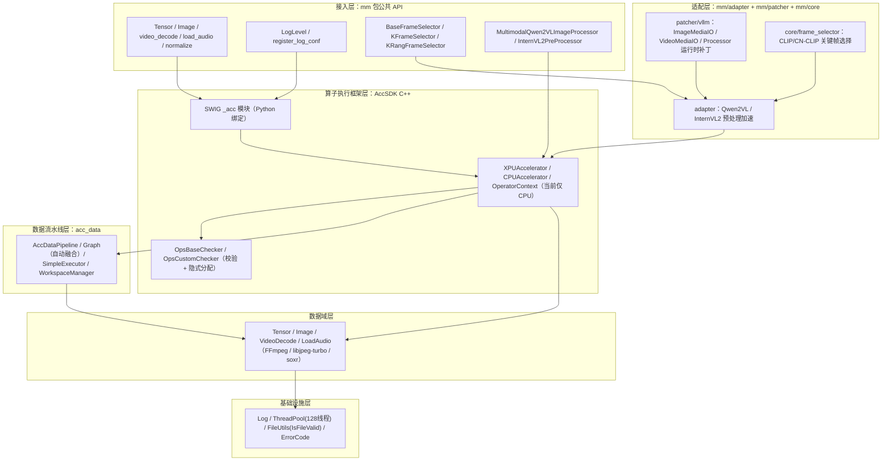
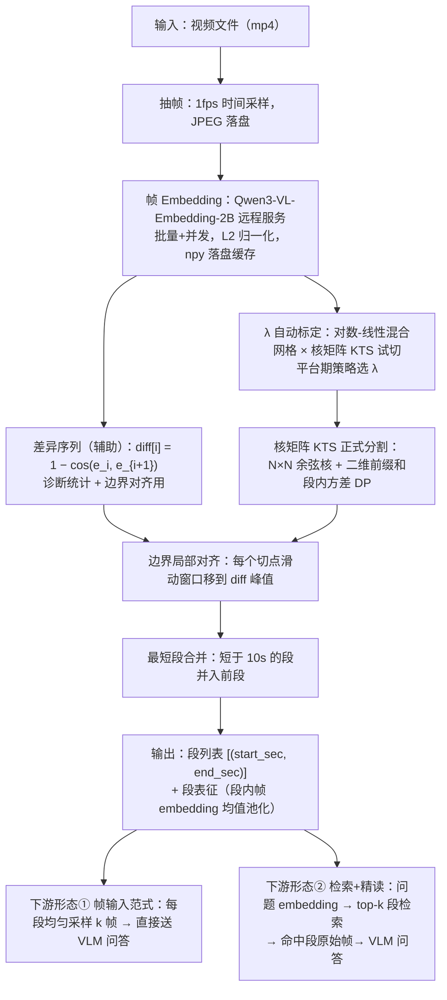
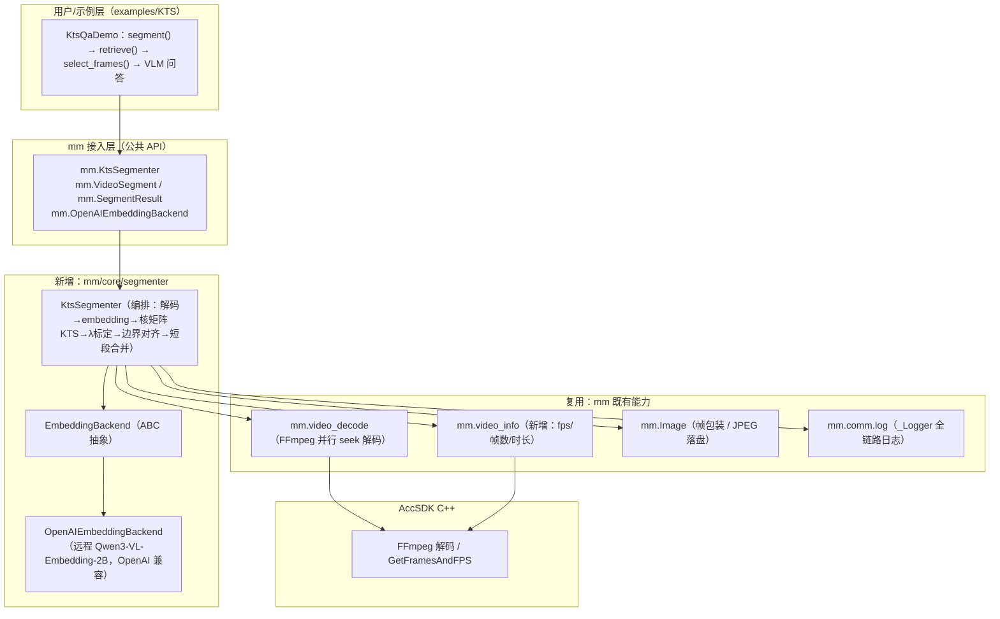
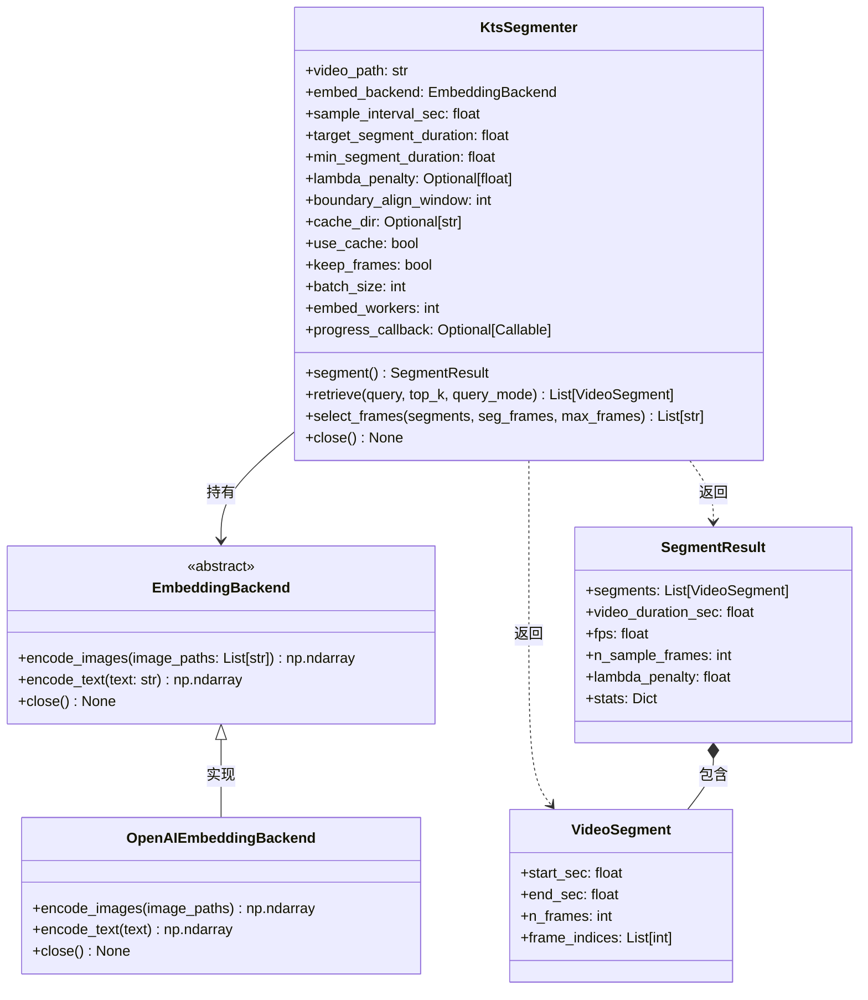

# kts_tokenizer 融合 MultimodalSDK 详细技术设计方案

## 1. 背景与目标

### 1.1 背景

- `MultimodalSDK`（v26.1.0，包名 `mm`）是面向昇腾多模态推理场景的预处理加速 SDK，现有视频相关能力为：`mm.video_decode`（FFmpeg 并行 seek 解码）、`mm.core.frame_selector`（CLIP/CN-CLIP 查询驱动关键帧选择）、`mm.adapter`/`mm.patcher`（Qwen2VL/InternVL2 预处理与 vLLM 运行时补丁）。
- `kts_tokenizer` 是基于论文 *Revisiting Kernel Temporal Segmentation as an Adaptive Tokenizer for Long-form Video*（Afham et al., ICCVW 2023）实现的**长视频语义分段**方案，已在独立调测环境完成多轮评测与基准实测，具备成熟度与数据支撑。

### 1.2 目标

将 `kts_tokenizer` 以**类（Class）形式**封装为 SDK 标准接口，作为长视频理解的原生能力对外提供，并满足三项硬性约束：

| 约束 | 量化基线（实测） | 融合后预期 |
| --- | --- | --- |
| 切分质量 | KTS切分质量高于uniform切分质量 | 端到端切分质量高于均匀切分 |
| 性能 | 编号 627 视频（53.5 分钟/3214 帧@1fps）**冷启动总耗时 522~566s**，耗时组成：抽帧 ~250s + embedding 232~314s（0.0846~0.0977 s/帧，随并发档位 w4~w1 变化）+ λ 标定等 ~12s；缓存命中后 KTS 预处理 11.6~12.0s | 同视频同服务下单阶段耗时偏差 ≤10% |
| 资源 | 检索形态 VLM 峰值 prompt token 2272（vs 全帧 12464）；客户端无 NPU 显存占用 | 无 OOM 异常 |

### 1.3 设计原则

1. **复用 SDK 能力**：抽帧复用 `mm.video_decode`（FFmpeg 并行 seek 解码；日志复用 `mm.comm.log`，安全校验复用 SDK 文件校验基线（非软链/属主/权限 ≤0640）。
2. **不破坏兼容性**：纯新增模块 + 两处导出注册（`mm/core/__init__.py`、`mm/__init__.py`），不修改任何既有类的行为。
3. **不引入重依赖**：剥离测试穿刺的 `av`/`scipy`/`paddle`/`mx_rag` 依赖，只保留 `numpy` 与 SDK 已有依赖。
4. **embedding 服务先用验证过的方案**：远程 `Qwen3-VL-Embedding-2B`，不引入未验证的本地模型。

---

## 2. 项目现状

### 2.1 架构与分层

SDK 六层架构：



### 2.2 与本方案直接相关的现有接口

| 接口 | 签名 | 关键约束 |
| --- | --- | --- |
| `mm.video_decode` | `(video_path: str\|bytes, device: str\|bytes, frame_indices: set = None, sample_num: int = -1) -> list[Image]` | 仅 mp4；宽高 `[480,4096]`；文件权限 ≤0640、非软链、属主一致；`frame_indices` 优先于 `sample_num` |
| `mm.Image` | `open/from_numpy/from_torch/from_pillow/resize/crop/to_tensor/numpy/pillow` | 仅 RGB；JPEG 解码走 libjpeg-turbo |
| `BaseFrameSelector` | `(model_path, device_id, model_type, similar_threshold, image_similar_threshold, image_size)` + 抽象 `select_keyframes(query, frames, sample_num, do_resample) -> (List[int], List[np.ndarray])` | `_check_input_valid` 逐项校验；`_validate_model_file_security`（属主+权限 ≤0750）；`batch_size=64` 分批防 OOM |
| `mm.comm.log` | `_Logger.debug/info/warn/error/fatal`、`register_log_conf(min_level, callback)` | 格式 `[LEVEL] UTC时间.毫秒.微秒 [file:line] function: message` |
| `mm.__init__` | 顶层导出 + `__all__` + 末尾 `register_log_conf(LogLevel.INFO, None)` | 新能力在此注册 |

### 2.3 编码与工程规范

1. 每个文件带 17 行 Mulan PSL v2 版权头（Copyright (c) 2026 Huawei Technologies Co.,Ltd.）。
2. Python 异常统一 `TypeError/ValueError/RuntimeError/FileNotFoundError/PermissionError/ImportError`，禁止静默吞错。
3. 所有文件输入过安全校验（非软链、属主、权限、大小上限）；进入 C++ 的字符串经 `_ensure_bytes` 拒绝 `\x00`。
4. 继承基类实现 + `_check_input_valid` + 抽象方法；批量处理显式 `batch_size` 防 OOM；长任务提供进度回调。
5. 测试用 pytest + `unittest.mock`（mock 模型/服务），不依赖真实 NPU/服务；顶层导出进 `__all__`。
6. 示例独立成目录（仿 `examples/K_FRAME`：README + 示例 + test.sh）。

## 3. kts_tokenizer 方案分析

### 3.1 算法原理与处理流程

 `kts_segmenter_v2.EmbeddingKTSVideoSegmenter`：



### 3.2 性能与显存特征（实测基线）

| 阶段 | 实测数据（编号 627 视频：3212.9s/29.97fps/3214 帧@1fps） |
| --- | --- |
| 抽帧 | 调测版 PyAV 全解码 ~120s（无争用）~250s（宿主机争用）；SDK `video_decode` 并行 seek 预期更快 |
| Embedding | 0.0846~0.0977 s/帧（910B4 服务，batch=64，workers=1~4； |
| λ 标定 | 10.9~12.0s（19 档 × KTS DP，随时长增长；19 档 = 低区 6 档对数 1e-4~3e-2 + 悬崖区 8 档加密 5e-2~7e-1 + 高区 5 档 1.0~10.0） |
| KTS DP | 0.57s@3214 帧（N×N float64 核矩阵+积分图 ≈165MB 峰值内存） |
| 客户端显存 | 远程 embedding 下无 NPU 显存；CPU 内存峰值 <500MB |
| 下游 VLM | 检索形态峰值 prompt token 2272（12 帧）vs 全帧 12464（68 帧） |

### 3.3 OOM 风险点与融合后预期

| 风险点 | 调测版缓解 | 融合后预期 |
| --- | --- | --- |
| 全帧驻留内存 | 帧落盘 JPEG、embedding 分批 | 同（且解码批次上限 64 帧/批） |
| KTS DP O(n²) | 积分图 + 向量化；3214 帧 165MB 可控 | 1h 视频（3600 帧）≈207MB，文档明确估算 |
| VLM 输入超长 | 帧数封顶 max_frames=24 → 峰值 token 2272 | 保持 |
| 服务排队 | 问题 embedding 与批量 embedding 错峰 | 进度回调 + 明确超时参数 |

### 3.4 依赖清单

| 依赖 | 用途 | 融合后 |
| --- | --- | --- |
| PyAV (`av`) | 抽帧/读元信息 | 改走 `mm.video_decode` + 新增 `mm.video_info`；`pyav` 后端作可选回退 |
| `scipy.gaussian_filter1d` | pairwise 模式平滑 | 融合后仅实现核矩阵 full 模式 |
| `paddle` | 环境 workaround | （调测环境需要） |
| `mx_rag.OpenAIEmbedding` | 图像 embedding 客户端 | 以 `OpenAIEmbeddingBackend` 替代 |
| `numpy` | 全部数值计算 | **保留**（SDK 已有） |
| `openai` 客户端 | embedding/查询 HTTP | **新增**（examples 已在使用，仅 embedding_backend 依赖） |

---

## 4. 融合总体设计

### 4.1 融合后长视频理解全链路（架构图）



数据流：`视频文件 → video_info(取 fps) → 计算 1fps 帧号集 → video_decode 分批(64帧/批) → JPEG 落盘缓存目录 → OpenAIEmbeddingBackend 分批编码(L2 归一化, npy 缓存) → 核矩阵 KTS + λ 标定 → 段列表+段表征 →（在线）问题编码 → top-k 段检索 → 段内选帧（封顶）→ 帧路径交还上层送 VLM`。

---

## 5. 类结构设计

### 5.1 类图



说明：`KtsSegmenter` 不继承 `BaseFrameSelector`；`EmbeddingBackend` 为独立类，两者均注册进 `mm` 顶层。`VideoSegment`/`SegmentResult` 为 dataclass，字段详细含义见 §6.2。

### 5.2 生命周期状态机

```
__init__（参数校验、构建/注入后端，不联网、不解码）
   → READY
segment()（解码+embedding+KTS；缓存命中时秒级；结果缓存在实例内）
   → SEGMENTED
retrieve()/select_frames()（仅 SEGMENTED 态可调用，否则 RuntimeError）
close()（释放后端；幂等；对象进入 CLOSED 态，后续调用抛 RuntimeError）
```

`__del__` 兜底调用 `close()`（吞异常，仅记日志）。

---

## 6. 接口详细定义

### 6.1 `KtsSegmenter.__init__`

```python
class KtsSegmenter:
    def __init__(
        self,
        video_path: str,
        embed_backend: Optional[EmbeddingBackend] = None,   # 注入后端；None 时用 embed_base_url 构建
        embed_base_url: Optional[str] = None,               # 远程 embedding 服务（OpenAI 兼容），如 http://ip:port/v1
        embed_model_name: str = "Qwen3-VL-Embedding-2B",
        sample_interval_sec: float = 1.0,                   # 时间采样间隔（1fps 论文基准）
        target_segment_duration: float = 60.0,              # λ 自动标定目标平均段长
        min_segment_duration: float = 10.0,                 # 最短段长，短段并入前段
        lambda_penalty: Optional[float] = None,             # None=自动标定（平台期策略）
        boundary_align_window: int = 3,                     # 边界局部对齐窗口（秒），0=关
        cache_dir: Optional[str] = None,                    # 默认 <视频同目录>/.kts_cache
        use_cache: bool = True,
        keep_frames: bool = True,                           # False 则 embedding 后删除帧 JPEG
        jpeg_quality: int = 80,
        batch_size: int = 64,                               # 单批帧数（防 OOM）
        embed_workers: int = 4,                             # 并行调用后端的 worker 数（调测实测最优档）
        progress_callback: Optional[Callable[[int, int], None]] = None,  # (done, total) 每批回调
    )
```

**参数表（校验规则）**

| 参数 | 类型 | 必填 | 默认 | 含义说明 | 校验规则 |
| --- | --- | --- | --- | --- | --- |
| video_path | str/bytes | 是 | — | 待分段视频文件路径（MP4） | 非空；文件存在（否则 `FileNotFoundError`）；非软链、属主为当前用户、权限 ≤0640（否则 `PermissionError`，与 SDK `IsFileValid` 基线一致）；扩展名 mp4（`ValueError`） |
| embed_backend | EmbeddingBackend\|None | 否 | None | 已创建好的"图片/文字→向量"能力对象（EmbeddingBackend 实例）；适合用户已有封装（如带内部鉴权的客户端）时直接传入，传了它就不需要 embed_base_url | 非 None 时必须是 EmbeddingBackend 实例（`TypeError`） |
| embed_base_url | str\|None | 否 | None | 远程 Qwen3-VL-Embedding-2B 服务的 OpenAI 兼容地址 | embed_backend 为 None 时必填（`ValueError`），且必须 http(s) 开头、以 `/v1` 结尾（`ValueError`） |
| embed_model_name | str | 否 | Qwen3-VL-Embedding-2B | 远程服务的模型名（served-model-name） | 非空（`ValueError`） |
| sample_interval_sec | float | 否 | 1.0 | 时间采样间隔（秒），1.0=1fps（论文基准） | (0, 3600]（`ValueError`） |
| target_segment_duration | float | 否 | 60.0 | λ 自动标定的目标平均段长（秒），决定切分粒度 | (0, 86400]（`ValueError`） |
| min_segment_duration | float | 否 | 10.0 | 最短段长（秒），过短段并入前段 | [0, target_segment_duration]（`ValueError`） |
| lambda_penalty | float\|None | 否 | None | KTS 算法的固定成本（λ） | None 或 >0（`ValueError`） |
| boundary_align_window | int | 否 | 3 | 边界局部对齐窗口（秒）：把每个切点移到 ±窗口 内画面跳变最大的采样点； | [0, 10]（`ValueError`） |
| cache_dir | str\|None | 否 | None | 帧 JPEG 与 embedding 缓存的存放目录；默认在视频同目录下 | 给定则必须存在且可写（`ValueError`） |
| use_cache | bool | 否 | True | 是否复用磁盘缓存（命中则跳过解码与 embedding） | —（`TypeError`） |
| keep_frames | bool | 否 | True | embedding 后是否保留帧 JPEG（VLM 精读需要原帧，默认保留） | —（`TypeError`） |
| jpeg_quality | int | 否 | 80 | 抽帧 JPEG 压缩质量 | [50, 100]（`ValueError`） |
| batch_size | int | 否 | 64 | 单批送入后端的帧数（内存控制） | 正整数（`ValueError`） |
| embed_workers | int | 否 | 4 | 并行调用后端的 worker 数 | 正整数（`ValueError`） |
| progress_callback | Callable\|None | 否 | None | 每完成一批帧回调 (done, total)，用于长视频进度展示 | 可调用（`TypeError`）；回调抛异常仅记 WARN 不中断 |

### 6.2 `segment()` 返回结构

```python
def segment(self) -> SegmentResult:
    """完整分段流水线（幂等：重复调用直接返回缓存结果，不重复计算）。"""

@dataclass
class VideoSegment:
    start_sec: float            # 段起始时刻（秒）
    end_sec: float              # 段结束时刻（秒）
    n_frames: int               # 段内采样帧数（1fps 口径）
    frame_indices: List[int]    # 段内帧在采样序列中的下标（升序）

@dataclass
class SegmentResult:
    segments: List[VideoSegment]        # 按时间升序，段间无重叠、无缝隙（覆盖 [0, duration]）
    video_duration_sec: float           # 视频时长
    fps: float                          # 视频帧率（来自 video_info）
    n_sample_frames: int                # 1fps 采样总帧数
    lambda_penalty: float               # 实际生效的 λ（自动标定结果或用户指定值）
    stats: Dict[str, object]            # 诊断统计，字段含义见下表
```

**`stats` 字段含义表**：

| 字段 | 含义 |
| --- | --- |
| `diff_min` / `diff_max` | 相邻帧相似度差异序列 `diff[i]=1−cos(e_i, e_{i+1})` 的最小值 / 最大值 |
| `diff_mean` / `diff_std` | 差异序列的均值 / 标准差|
| `timing.decode_s` | 解码 + 抽帧阶段耗时（秒） |
| `timing.embed_s` | 帧 embedding 阶段耗时（秒） |
| `timing.lambda_s` | λ 自动标定耗时（秒，19 档对数-线性混合网格扫描） |
| `timing.kts_dp_s` | 核矩阵 KTS 动态规划耗时（秒） |
| `timing.total_s` | `segment()` 全流程总耗时（秒） |

### 6.3 `retrieve()` / `select_frames()`

```python
def retrieve(
    self, query: str, top_k: int = 3, query_mode: str = "question"
) -> List[VideoSegment]:
    """问题文本检索 top-k 相关段（按时间升序返回）。
    query: 非空 str；top_k: 正整数（>段数时返回全部段，不报错）；
    query_mode: "question" | "question_options"（后者拼接选项文本）。"""

def select_frames(
    self, segments: List[VideoSegment], seg_frames: int = 4, max_frames: int = 24
) -> List[str]:
    """从给定段内均匀选帧，返回帧文件路径（按时间升序去重）。
    总帧数超 max_frames 时按段数均摊降帧（k_eff=max(1, min(seg_frames, max_frames//段数))）。
    segments 为空抛 ValueError；seg_frames/max_frames 为正整数（ValueError）。
    帧文件被清理（keep_frames=False）时抛 RuntimeError 并提示重新 segment。"""
```

### 6.4 异常列表

| 异常 | 触发场景 |
| --- | --- |
| TypeError | 参数类型不符（逐项校验，消息引用参数名） |
| ValueError | 参数取值/状态非法（未 segment 调 retrieve、空 query、segments 为空等） |
| FileNotFoundError | 视频/缓存目录不存在 |
| PermissionError | 文件属主/权限/软链不满足 SDK 安全基线 |
| ImportError | 使用远程后端但未安装 `openai` |
| RuntimeError | embedding 服务不可达/返回异常、解码失败、后端返回维度不符（消息携带服务端原因） |

### 6.5 顶层注册（对外导入路径示例）

```python
# mm/__init__.py 新增导出（与现有风格一致）
from .core import KtsSegmenter, VideoSegment, SegmentResult, EmbeddingBackend, OpenAIEmbeddingBackend
__all__ += [...]

# 用户调用
from mm import KtsSegmenter, OpenAIEmbeddingBackend, SegmentResult

seg = KtsSegmenter(                            # ① 创建分段器：绑定视频文件与远程 embedding 服务
    "/path/video.mp4",                         #    （此步只做参数校验，不联网、不解码）
    embed_base_url="http://192.168.9.144:18080/v1",
    progress_callback=lambda d, t: print(f"{d}/{t}"),   # 长视频 embedding 进度回调（可选）
)
result: SegmentResult = seg.segment()          # ② 执行语义分段：返回段列表+诊断统计（缓存命中秒级）
top_segs = seg.retrieve(                       # ③ 用问题检索 top-3 相关段（检索+精读形态）
    "视频中出现了哪些交通标志", top_k=3)
frame_paths = seg.select_frames(               # ④ 从命中段内均匀选帧（4 帧/段，总上限 24 帧），
    top_segs, seg_frames=4, max_frames=24)     #    返回帧文件路径（供上层送 VLM）
# ⑤ 上层把 frame_paths 编码后送 VLM 问答（SDK 不包含 VLM 调用，参考 examples/KTS/KtsQaDemo）
seg.close()                                    # ⑥ 释放后端资源（远程后端 = 关闭 HTTP 连接池；幂等）
```

---

## 7. 目录结构变更清单

```
MultimodalSDK/
├── source/mm/
│   ├── core/
│   │   ├── __init__.py                        [修改] 导出 segmenter 符号
│   │   └── segmenter/                          [新增目录]
│   │       ├── __init__.py                    [新增] __all__ 汇总
│   │       ├── embedding_backend.py           [新增] EmbeddingBackend(ABC)/OpenAIEmbeddingBackend
│   │       └── kts_segmenter.py               [新增] VideoSegment/SegmentResult/KtsSegmenter
│   ├── acc/wrapper/video_wrapper.py           [修改] 新增 video_info 函数（纯新增，不改 video_decode）
│   └── __init__.py                            [修改] 顶层导出 + __all__
├── test/
│   ├── test_kts_segmenter.py                  [新增] KtsSegmenter 单元测试（mock 解码与后端）
│   └── test_embedding_backend.py              [新增] 后端协议/校验/超时单元测试（mock openai）
├── examples/
│   └── KTS/                                   [后续新增目录]
│       ├── kts_qa_example.py                  [新增] KtsQaDemo：segment→retrieve→select_frames→VLM
│       ├── README.md                          [新增] 运行说明（含 910B4 服务/权限 chmod 指引）
│       ├── test.sh                            [新增] 执行脚本
│       └── scene_eval/                        [新增目录] 切分质量评测（L4）
│           ├── evaluate_scene_quality.py      [新增] 真值边界评测：段边界 vs GT → P/R/F1@容差 + M_iou + AP
│           └── README.md                      [新增] 数据集获取/格式转换/运行说明
├── docs/zh/
│   ├── 05_api/kts_segmenter.md                [后续新增] API 文档（参数表/返回值/异常/示例）
│   └── 04_user_guide/user_guide.md            [修改] 新增"长视频语义分段与检索"章节
├── test/presmoke/presmoke_config.yaml         [修改] path_mapping 增加 segmenter 映射
└── （无其他改动；AccSDK C++ 无需新增代码——GetFramesAndFPS 已存在，SWIG 暴露即可）
```

**video_info 接口（新增，配合 KtsSegmenter 1fps 采样）**：

```python
# video_wrapper.py 新增（与 video_decode 并列）
def video_info(video_path: str | bytes) -> dict:
    """返回 {"fps": float, "n_frames": int, "duration_sec": float}。
    校验规则与 video_decode 完全一致（mp4/权限/属主/非软链）。
    实现：_acc.VideoGetInfo（SWIG 暴露 C++ GetFramesAndFPS/InitVideoInfo 已有能力）。"""
```

若 C++ 暴露工作量超出预期，回退：`KtsSegmenter` 增加 `fps: Optional[float]` 参数，用户显式提供（文档注明获取方式），video_info 延后。

---

## 8. 依赖分析

### 8.1 依赖第三方依赖（懒加载）

| 依赖 | 版本 | 用途 | 兼容性说明 |
| --- | --- | --- | --- |
| `openai` | >=1.30（与 examples 已用版本一致） | OpenAIEmbeddingBackend 的 HTTP 客户端 | 纯 Python 客户端，与 SDK 构建环境（pip 离线安装）兼容；仅在**实例化远程后端**时才 import（延迟导入），不用远程后端不依赖 |
| `numpy` | 已有（1.26.4） | 数值计算 | 无新增 |

## 9 测试用例设计

`test_kts_segmenter.py`（mock `mm.video_decode`/`video_info` + mock EmbeddingBackend）：
1. `__init__` 参数校验矩阵（§6.1 校验规则逐项 × 合法/非法值）
2. KTS DP 正确性：构造 3 段分明的合成 embedding 序列，断言切分点精确命中
3. λ 平台期策略：固定 diff 统计，断言 19 档扫描结果与调测版记录全等、退化排除、回退分支
4. 边界对齐：±3s 窗口峰值移动、<2 帧去重
5. 最短段合并：首段/中段/末段短段三态
6. 缓存：命中路径不再调后端（mock 断言调用次数）、key 随 embed_backend_id 变化
7. 状态机：未 segment 调 retrieve/select_frames 抛 RuntimeError；close 幂等
8. 选帧封顶：seg_frames/max_frames 均摊与总帧上限
9. 进度回调：累计 (done,total) 覆盖全部帧；回调抛异常不中断

`test_embedding_backend.py`（mock openai）：
1. encode_images/encode_text 请求构造（URL/模型/字段）、响应解析、L2 归一化
2. 服务端错误 → RuntimeError 携带原因；超时参数生效
3. protocol="custom" 注入路径

## 10. 服务器部署测试步骤

### 10.1 前置检查（910B4 宿主机）

```bash
# 1) 权重完整性（缺任一文件 vLLM 启动即退）
ls /home/data/Qwen3-VL-Embedding-2B
#   必需：config.json / preprocessor_config.json / tokenizer* / processor* / *.safetensors

# 2) 卡资源（选一张空闲卡；已部署服务按 gpu-memory-utilization 0.9 预分配 ~59GB）
npu-smi info | grep -E '[0-9]+\s*/\s*[0-9]{4,}'
```

### 10.2 embedding 服务容器部署脚本（deploy_vllm_embedding_910b.sh）

```bash
#!/bin/bash
device_id=$1
port=$2
if [ -z "$device_id" ] || [ -z "$port" ]; then
    echo "用法: $0 <device_id> <port>"
    exit 1
fi

export IMAGE=quay.io/ascend/vllm-ascend:v0.23.0
docker stop vllm-qwen-embedding-$device_id-$port 2>/dev/null
sleep 1

docker run --rm --name vllm-qwen-embedding-$device_id-$port \
    --privileged=true \
    --shm-size=8g \
    --net=host \
    --device /dev/davinci0 \
    --device /dev/davinci_manager \
    --device /dev/devmm_svm \
    --device /dev/hisi_hdc \
    -v /usr/local/dcmi:/usr/local/dcmi \
    -v /usr/local/bin/npu-smi:/usr/local/bin/npu-smi \
    -v /usr/local/Ascend/driver/lib64/:/usr/local/Ascend/driver/lib64/ \
    -v /usr/local/Ascend/driver/version.info:/usr/local/Ascend/driver/version.info \
    -v /etc/ascend_install.info:/etc/ascend_install.info \
    -v /home/data:/home/data \
    -e ASCEND_RT_VISIBLE_DEVICES=$device_id \
    -e PYTORCH_NPU_ALLOC_CONF=expandable_segments:True \
    -itd $IMAGE vllm serve /home/data/Qwen3-VL-Embedding-2B \
    --served-model-name Qwen3-VL-Embedding-2B \
    --additional-config '{"ascend_compilation_config": {"fuse_norm_quant": false}}' \
    --runner pooling \
    --dtype float16 \
    --port $port \
    --max-model-len 2048 \
    --gpu-memory-utilization 0.9 \
    --max-num-seqs 512 \
    --max-num-batched-tokens 65536
```

参数说明：`--max-model-len 2048`（406 会拒绝 902-token 图像请求）；`--gpu-memory-utilization 0.9`（放开批空间）；`--max-num-seqs 512` + `--max-num-batched-tokens 65536`（批容量，服务端 ~10k tokens/s 饱和点）。

### 10.3 启动与验证

```bash
./deploy_vllm_embedding_910b.sh 0 18080
sleep 60                                        # 模型加载约 1-3 分钟
docker logs vllm-qwen-embedding-0-18080 2>&1 | tail -20   # 应见 Application startup complete / Uvicorn running
curl http://<910B4_IP>:18080/v1/models          # 返回 id 必须为 Qwen3-VL-Embedding-2B
npu-smi info | grep -E '[0-9]+\s*/\s*[0-9]{4,}'  # 目标卡 HBM 应跳涨 ~59000MB（预分配）
```

常见启动问题速查：返回的模型是 `bge-reranker-v2-m3` = 端口被占用（换端口）；`unrecognized arguments: --disable-log-requests` = 该参数不存在；`decoder prompt 902 > 406` = max-model-len 太小（用 2048）；

### 10.4 VLM 服务验证（已有服务，无需新建）

```bash
curl http://192.168.9.146:9999/v1/models    # qwen2.5-vl-7b-instruct
```

### 10.5 SDK 环境准备与权限

```bash
source /usr/local/multimodal/script/set_env.sh
chmod 640 <video.mp4>            # SDK 文件安全基线：权限 ≤0640、非软链、属主一致
```

### 10.6 调测步骤（实现完成后按序执行）

```bash
# 1) 单元测试（无 NPU/无服务环境可跑）
pytest --cov=source/mm -vs test/test_kts_segmenter.py test/test_embedding_backend.py

# 2) 分段对齐（627 视频，需 910B4 服务）
python align_with_legacy.py --video /worksapce/RAGSDK/models/Video-MME/videos/data/yQ6VOOd73MA.mp4 \
    --embed-url http://192.168.9.144:18080/v1

# 2.5) 切分质量评测（真值场景边界，L4；数据集获取见 examples/KTS/scene_eval/README.md）
python examples/KTS/scene_eval/evaluate_scene_quality.py \
    --video-dir /path/to/planet_earth/videos --gt-dir /path/to/planet_earth/annotations \
    --gt-format planet_earth_xml --embed-url http://192.168.9.144:18080/v1 \
    --baseline uniform --tolerance 1,2,3 --out scene_quality.json
# 判读：KTS F1@±2s 显著高于 uniform（sanity）；与调测版逐边界匹配率 ≥95%（L4 主判据）

# 3) 性能 A/B（冷启动基准，对照调测版基线 522~566s 总耗时 / 0.0846~0.0977 s/帧）
python bench_embed.py --video .../yQ6VOOd73MA.mp4 --embed-url http://192.168.9.144:18080/v1 \
    --clear-cache --embed-workers 4 --out bench_sdk_w4.json

# 4) 端到端 QA 抽样（≥30 题，需 VLM 服务）
bash run_qa_align.sh
```

验收：L1 全绿 → L2 判据通过 → 性能偏差 ≤10% → L3 一致率 ≥95% 且 McNemar 无显著劣化 → 无 OOM。

---
