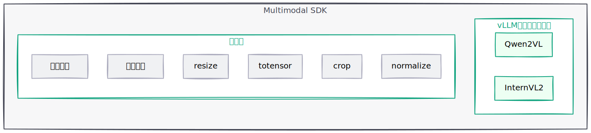

# 简介

多模态大模型推理流程中需要处理大量复杂的数据。Multimodal SDK 通过提供一系列高性能的昇腾设备亲和性接口，加速大模型推理预处理流程。

- 包括图像视频加载和解码，resize、crop 等预处理常用操作。
- 支持多种开源数据结构与加速库数据结构的相互转换，方便快速使用和移植。

## 软件架构

**架构图模块介绍**

| 模块 | 说明 |
| -- | -- |
| vLLM 框架预处理插件 | 使用 vLLM 进行大模型推理时提供加速能力。Qwen2VL：使用 Qwen2VL 模型时提供图像/视频预处理加速能力，对比 transformers 的预处理时延可大幅度缩短。InternVL2：使用 InternVL2 模型时提供图像/视频预处理加速能力。 |
| 加速库 | 提供一系列高性能图像和张量处理接口。 |

## 支持的硬件和操作系统

> **查询设备产品型号**
>
> 在 Linux 系统中，可通过以下两种方式查询设备产品型号：
>
> 1. 使用 `dmidecode` 命令：dmidecode -s system-product-name
>
> 2. 读取 sysfs 文件：cat /sys/class/dmi/id/product_name
>
> 两种方式均可获取设备的产品型号信息，您可根据实际需求选择使用。

| 产品系列 | 产品型号 | 操作系统版本 |
| -- | -- | -- |
| Atlas A2 推理系列产品 | Atlas 800I A2 推理服务器 | Ubuntu 22.04 / openEuler 24.03 |
