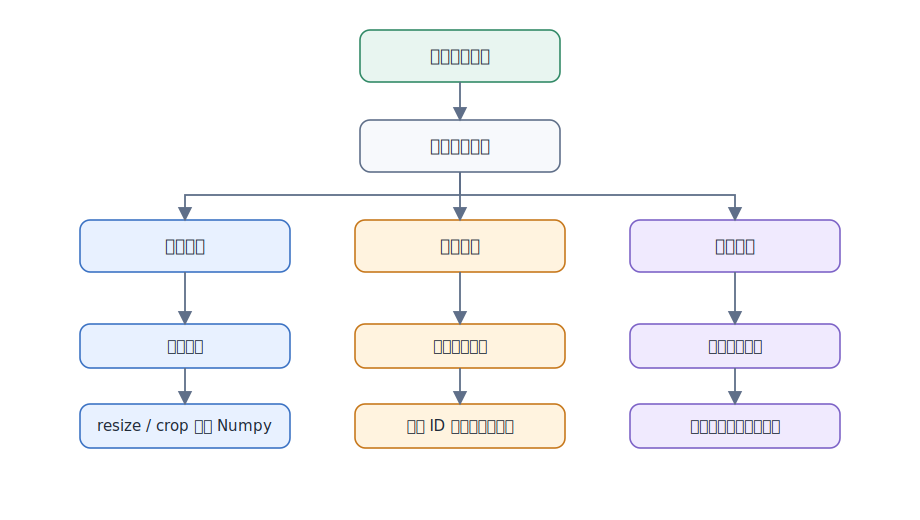
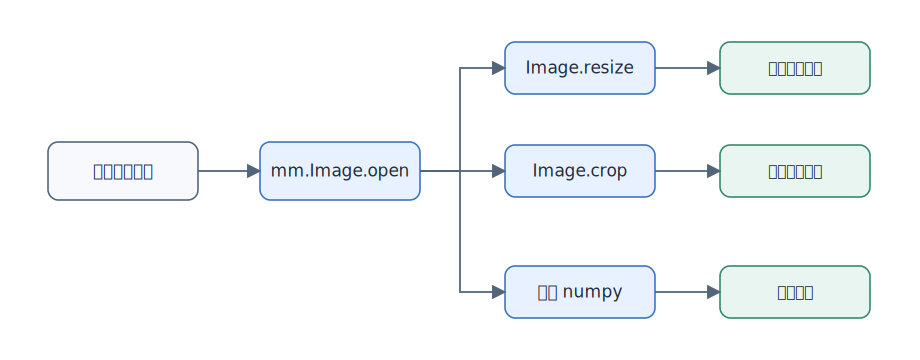
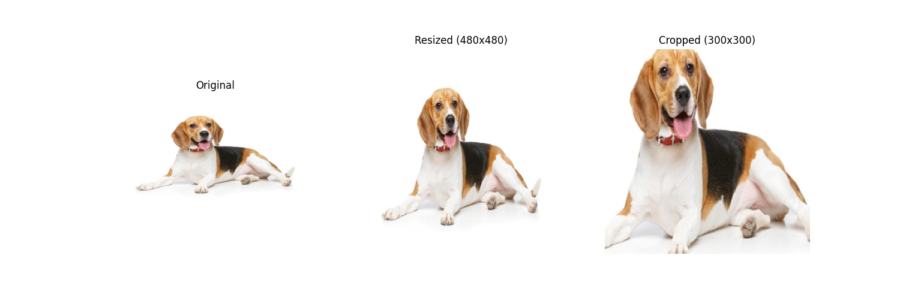
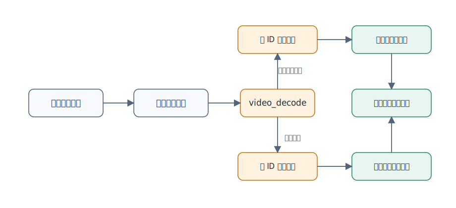
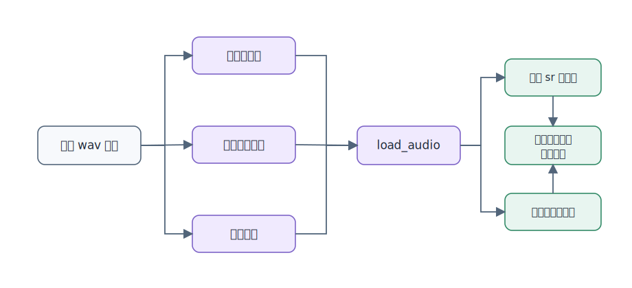

# 样例和指导

本文通过图片、视频和音频三个典型场景，说明 Multimodal SDK 的基础预处理接口使用方式。整体流程如下：



## 使用前准备

- 本文档适用于 Multimodal SDK 最新发布版本，建议使用 Python 3.10 或 3.11。
- 请先完成[快速入门](../02_quickstart/quickstart.md)或[安装部署](../03_installation_guide/installation_guide.md)，确认 `import mm` 成功。
- 图片示例需要安装 `matplotlib`，仅用于展示处理结果：`pip3 install matplotlib`。
- 示例文件权限不应高于 640。图片当前支持 jpg/jpeg，视频当前支持 mp4，音频当前支持 wav。

## 图片处理

以下是一个简单的参考样例，通过多模态 SDK 的 Image 类读取图像，并进行缩放、裁剪，最后转化为通用的 Numpy 数组展示上述操作的效果。



```python
import mm  # 引入多模态SDK包
import matplotlib.pyplot as plt  # 仅做图像展示使用

dog_img = mm.Image.open("/home/test.jpg")  # 通过多模态Image类，从实际文件构造Image变量（注意文件权限不能超过640）
dog_resized_img = dog_img.resize((480, 480), mm.Interpolation.BICUBIC, mm.DeviceMode.CPU)  # 使用双立方插值算法在CPU模式下对图像进行缩放
dog_cropped_img = dog_resized_img.crop(100, 100, 300, 300, mm.DeviceMode.CPU)  # 基于缩放后的图像使用CPU模式进行裁剪

resized_np = dog_resized_img.numpy()  # 将缩放的图像转化为Numpy数组，方便后续对其进行展示
cropped_np = dog_cropped_img.numpy()  # 将裁剪的图像转化为Numpy数组，方便后续对其进行展示
original_dog = dog_img.numpy()  # 将构造的原图像转化为Numpy数组，方便后续对其进行展示

# 以下为展示图像代码
plt.figure(figsize=(15, 5))

plt.subplot(1, 3, 1)
plt.title("Original")
plt.imshow(original_dog)
plt.axis("off")

plt.subplot(1, 3, 2)
plt.title("Resized (480x480)")
plt.imshow(resized_np)
plt.axis("off")

plt.subplot(1, 3, 3)
plt.title("Cropped (300x300)")
plt.imshow(cropped_np)
plt.axis("off")

plt.show()
```



## 视频处理

多模态 SDK 的视频解码接口支持两种参数设置方式，用户可按需选择。`frame_indices` 的类型为 `set`，表示期望解码的视频帧 ID 集合；`sample_num` 表示当 `frame_indices` 为空时均匀采样的目标帧数。若 `frame_indices` 非空，接口优先按指定帧 ID 解码，`sample_num` 不再生效。

- 如果传入了**期望解码的视频帧 ID**集合且其内容合法，SDK 会根据这些帧 ID 进行解码，返回的 image 对象列表长度与帧 ID 集合大小一致。
- 如果帧 ID 集合为空，则可以通过**期望解码后获取的总帧数**参数进行设置，此时接口会从视频中均匀采样指定数量的帧，最终返回的 image 对象列表长度等于设定的帧数。



1. 传入目标解码的帧 ID 集合，得到的返回值列表大小为传入的帧 ID 集合大小。

    ```python
    from mm import video_decode
    import os

    norm_file_path = "/home/test/xxx.mp4"  # 要解码的视频文件地址
    os.chmod(norm_file_path, 0o640)  # 修改权限
    frame_indices = {0, 48, 96, 145, 193, 241, 290, 338, 386, 435, 483, 531}
    mm_images = video_decode(norm_file_path, "cpu", frame_indices)
    print(f"mm_images count: {len(mm_images)}")
    ```

    ```text
    mm_images count: 12
    ```

2. 传入目标解码的帧 ID 列表为空，传入期望解码后获取的总帧数，得到的返回值列表大小为传入的期望解码后获取的总帧数大小。

    ```python
    from mm import video_decode
    import os

    norm_file_path = "/home/test/xxx.mp4"  # 要解码的视频文件地址
    os.chmod(norm_file_path, 0o640)  # 修改权限
    mm_images = video_decode(norm_file_path, "cpu", set(), 10)
    print(f"mm_images count: {len(mm_images)}")
    ```

    ```text
    mm_images count: 10
    ```

## 音频处理

以下示例演示单音频文件加载与批量加载（请将路径替换为实际 wav 文件，并确保文件权限不高于 640）：



```python
from mm import load_audio

# 单文件加载
single_audio_path = "/path/to/speech.wav"
waveform, sr = load_audio(single_audio_path)
print(f"single audio shape: {waveform.shape}, sample rate: {sr}")

# 从文件列表批量加载
audio_file_paths = ["/path/to/audio1.wav", "/path/to/audio2.wav"]
batch_from_filelist = load_audio(audio_file_paths)
print(f"batch count: {len(batch_from_filelist)}")

# 从目录批量加载
audio_directory = "/path/to/audio_dir"
batch_from_directory = load_audio(audio_directory)
print(f"directory batch count: {len(batch_from_directory)}")
```

如需指定重采样率，可传入 `sr` 参数，例如 `load_audio(single_audio_path, sr=16000)`。

返回值说明：

- 输入单个音频文件时，返回 `(waveform, sr)`，其中 `waveform` 为音频 Tensor，`sr` 为采样率。
- 输入音频文件列表或目录时，返回 `(waveform, sr)` 元组列表。

## 下一步

| 目标 | 文档 |
| -- | -- |
| 查看完整 API 参数和约束 | [功能函数参考](../05_api/function_reference.md) |
| 排查常见错误码 | [附录 - 错误码](../06_references/appendix.md#错误码) |
| Qwen2VL / InternVL2 预处理加速 | [Adapter](../05_api/adapter.md) |
| vLLM 推理框架集成 | [patcher](../05_api/patcher.md) |
