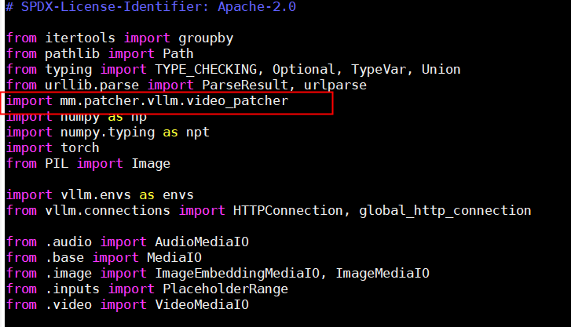
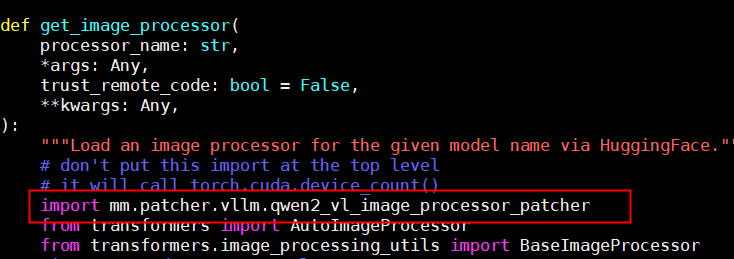
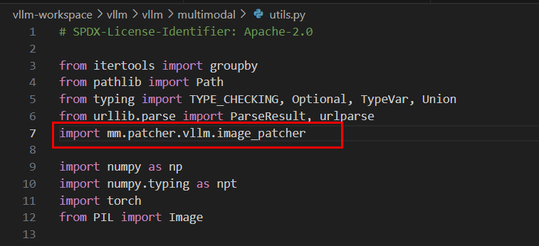
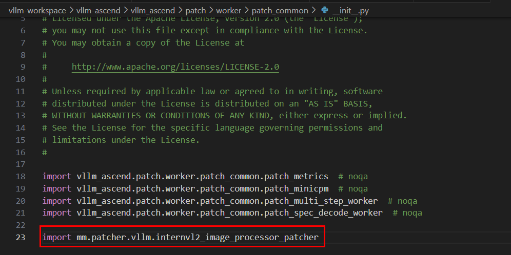

# patcher

## 公共前置条件

使用以下任一 patcher 前，请完成以下准备工作：

- 目前仅支持从 vllm-ascend 社区获取 **v0.8.5rc1** 镜像版。
- 镜像安装方式请参见 [vllm-ascend](https://vllm-ascend.readthedocs.io/en/v0.8.5rc1/installation.html)，安装时请选择 **Using docker**（从容器中安装）。
- 在镜像中使用 Multimodal SDK 能力时，请首先执行以下命令：

```bash
export LD_LIBRARY_PATH=/usr/local/Ascend/driver/lib64:/usr/local/Ascend/driver/lib64/common:/usr/local/Ascend/driver/lib64/driver:$LD_LIBRARY_PATH
```

> [!CAUTION] 注意
> 使用 qwen2_vl_image_processor_patcher 或 internvl2_image_processor_patcher 时，还需保证 transformers 版本为 **4.51.3**。Multimodal SDK 官方镜像已包含该版本；若在自定义环境中使用，请执行 `python3 -c "import transformers; print(transformers.__version__)"` 确认版本。

本文档仅提供通过社区获取镜像的使用方式。对于其他使用方式，需自行找到以下所提到的文件并执行操作。

---

## video_patcher

该补丁为 vllm 视频解码提供加速能力，可以大幅度提升视频文件的读取、解码效率。

前置条件请参见 [公共前置条件](#公共前置条件)。

**使用方式**

在 vllm 包的 `utils.py` 文件中添加如下内容，该文件路径在镜像中的位置为 `/vllm-workspace/vllm/vllm/multimodal/utils.py`：

```python
import mm.patcher.vllm.video_patcher
```

共计需要添加一个位置，在文件头添加以上内容即可，如下图所示。



添加成功后，当使用 vllm 服务并传入视频文件数据时，若可以看到如下提示信息，则表示使用成功。

```text
load_file: Multimodal SDK Video Patcher Enabled!
```

> [!CAUTION] 注意
> 当前加速能力仅针对视频文件，且格式应为 mp4，文件权限不应高于 640。

**示例请求**

以下 curl 命令向 vllm 服务化的 OpenAI 兼容接口 `/v1/chat/completions` 发送视频推理请求。请将 `<host>`、`<port>`、模型路径及视频文件路径替换为实际值后再执行。其他 vllm 参数请参见 [vllm 官方文档](https://docs.vllm.ai/en/v0.8.5/serving/openai_compatible_server.html#chat-api)。

```bash
curl -X POST "http://<host>:<port>/v1/chat/completions" \
  -H "Content-Type: application/json" \
  -d '{
    "model": "/home/Qwen2-VL-7B-Instruct",
    "messages": [
      {
        "role": "user",
        "content": [
          {
            "type": "video_url",
            "video_url": {
              "url": "file:/home/234_chunk_0001.mp4"
            }
          },
          {
            "type": "text",
            "text": "describe the video"
          }
        ]
      }
    ],
    "max_tokens": 100,
    "temperature": 0,
    "top_p": 0.1,
    "stream": false
  }'
```

**关键参数说明**

| 参数 | 说明 |
| -- | -- |
| `model` | vllm 服务启动时加载的模型路径，需与启动参数 `--model` 一致。 |
| `messages` | 对话消息列表；`role` 通常为 `user`，`content` 为文本与多模态内容的数组。 |
| `content[].type` | 多模态内容类型。视频请求使用 `video_url`，文本提示使用 `text`。 |
| `content[].video_url.url` | 本地视频路径，使用 `file:` 协议前缀；须为 **mp4** 格式，文件权限不应高于 **640**（参见上文注意事项）。 |
| `content[].text` | 针对视频的文本提示词。 |
| `max_tokens` | 生成回复的最大 token 数。 |
| `temperature` / `top_p` | 采样参数，控制输出随机性；设为 `0` 与较小 `top_p` 时输出更稳定。 |
| `stream` | 是否以流式方式返回结果；`false` 表示等待完整响应后一次性返回。 |

---

## qwen2_vl_image_processor_patcher

该补丁为 vllm 在使用 Qwen2-VL 模型时的图像/视频预处理提供加速能力，对比 transformers 的预处理时延可大幅度缩短。

前置条件请参见 [公共前置条件](#公共前置条件)（含 transformers 4.51.3 要求）。

**使用方式**

在 vllm 包的 `processor.py` 文件中添加如下内容，该文件路径在镜像中的位置为 `/vllm-workspace/vllm/vllm/transformers_utils/processor.py`：

```python
import mm.patcher.vllm.qwen2_vl_image_processor_patcher
```

共计需要添加以下两个位置：

- 在函数 `get_processor` 中的 `from transformers import AutoProcessor` 的前一行添加，若使用容器，则为 62~63 行，如下图所示。

  

- 在函数 `get_image_processor` 中的 `from transformers import AutoImageProcessor` 的前一行添加，若使用容器，则为 174~175 行，如下图所示。

  

添加成功后，当正常运行 vllm 服务时，在正常对话后若可以看到如下提示信息，则表示使用了多模态 Qwen2-VL 图像/视频预处理加速功能。

```text
get_image_processor_class_from_name: Multimodal SDK Qwen2 VL Image Patcher Enabled!
```

**示例请求**

以下 curl 命令向 vllm 服务化的 OpenAI 兼容接口 `/v1/chat/completions` 发送推理请求。请将 `<host>`、`<port>`、模型路径及媒体文件路径替换为实际值后再执行。其他 vllm 参数请参见 [vllm 官方文档](https://docs.vllm.ai/en/v0.8.5/serving/openai_compatible_server.html#chat-api)。

**视频示例**

```bash
curl -X POST "http://<host>:<port>/v1/chat/completions" \
  -H "Content-Type: application/json" \
  -d '{
    "model": "/home/Qwen2-VL-7B-Instruct",
    "messages": [
      {
        "role": "user",
        "content": [
          {
            "type": "video_url",
            "video_url": {
              "url": "file:/home/234_chunk_0001.mp4"
            }
          },
          {
            "type": "text",
            "text": "describe the video"
          }
        ]
      }
    ],
    "max_tokens": 100,
    "temperature": 0,
    "top_p": 0.1,
    "stream": false
  }'
```

**图像示例**

```bash
curl -X POST "http://<host>:<port>/v1/chat/completions" \
  -H "Content-Type: application/json" \
  -d '{
    "model": "/home/Qwen2-VL-7B-Instruct",
    "messages": [
      {
        "role": "user",
        "content": [
          {
            "type": "image_url",
            "image_url": {
              "url": "file:/home/test.jpg"
            }
          },
          {
            "type": "text",
            "text": "describe the image"
          }
        ]
      }
    ],
    "max_tokens": 100,
    "temperature": 0,
    "top_p": 0.1,
    "stream": false
  }'
```

**关键参数说明**

| 参数 | 说明 |
| -- | -- |
| `model` | vllm 服务启动时加载的模型路径，需与启动参数 `--model` 一致。 |
| `messages` | 对话消息列表；`role` 通常为 `user`，`content` 为文本与多模态内容的数组。 |
| `content[].type` | 多模态内容类型。视频请求使用 `video_url`，图像请求使用 `image_url`，文本提示使用 `text`。 |
| `content[].video_url.url` | 本地视频路径，使用 `file:` 协议前缀。 |
| `content[].image_url.url` | 本地图像路径，使用 `file:` 协议前缀。 |
| `content[].text` | 针对视频或图像的文本提示词。 |
| `max_tokens` | 生成回复的最大 token 数。 |
| `temperature` / `top_p` | 采样参数，控制输出随机性；设为 `0` 与较小 `top_p` 时输出更稳定。 |
| `stream` | 是否以流式方式返回结果；`false` 表示等待完整响应后一次性返回。 |

---

## image_patcher

该补丁为 vllm 图片解码提供加速能力，可以大幅度提升图片文件的读取、解码效率。

前置条件请参见 [公共前置条件](#公共前置条件)。

**使用方式**

在 vllm 包的 `utils.py` 文件中添加如下内容，该文件路径在镜像中的位置为 `/vllm-workspace/vllm/vllm/multimodal/utils.py`：

```python
import mm.patcher.vllm.image_patcher
```

在文件头位置添加以上内容即可，如下图所示。



添加成功后，当使用 vllm 服务并传入图像文件数据时，若可以看到如下提示信息，表示使用成功。

```text
load_file: Multimodal SDK Image Patcher Enabled!
```

> [!CAUTION] 注意
> 当前加速能力仅针对 jpeg 图像，且文件后缀应为 jpg 或 jpeg，文件权限不应高于 640。

**示例请求**

以下 curl 命令向 vllm 服务化的 OpenAI 兼容接口 `/v1/chat/completions` 发送图像推理请求。请将 `<host>`、`<port>`、模型路径及图像文件路径替换为实际值后再执行。其他 vllm 参数请参见 [vllm 官方文档](https://docs.vllm.ai/en/v0.8.5/serving/openai_compatible_server.html#chat-api)。

```bash
curl -X POST "http://<host>:<port>/v1/chat/completions" \
  -H "Content-Type: application/json" \
  -d '{
    "model": "/home/models/internVL2",
    "messages": [
      {
        "role": "user",
        "content": [
          {
            "type": "image_url",
            "image_url": {
              "url": "file:/home/test.jpg"
            }
          },
          {
            "type": "text",
            "text": "describe the image"
          }
        ]
      }
    ],
    "max_tokens": 100,
    "temperature": 0.1,
    "top_p": 0.1,
    "stream": false
  }'
```

**关键参数说明**

| 参数 | 说明 |
| -- | -- |
| `model` | vllm 服务启动时加载的模型路径，需与启动参数 `--model` 一致。 |
| `messages` | 对话消息列表；`role` 通常为 `user`，`content` 为文本与多模态内容的数组。 |
| `content[].type` | 多模态内容类型。图像请求使用 `image_url`，文本提示使用 `text`。 |
| `content[].image_url.url` | 本地图像路径，使用 `file:` 协议前缀；须为 **jpeg** 格式，文件后缀为 **jpg** 或 **jpeg**，文件权限不应高于 **640**（参见上文注意事项）。 |
| `content[].text` | 针对图像的文本提示词。 |
| `max_tokens` | 生成回复的最大 token 数。 |
| `temperature` / `top_p` | 采样参数，控制输出随机性。 |
| `stream` | 是否以流式方式返回结果；`false` 表示等待完整响应后一次性返回。 |

## 常见问题与排障

| 现象 | 处理方式 |
| -- | -- |
| 未看到 `Multimodal SDK ... Patcher Enabled!` 提示 | 确认已在文档指定文件和位置添加对应 `import mm.patcher.vllm...` 语句，并重启 vllm 服务。 |
| 图像或视频读取失败 | 确认文件路径使用 `file:` 协议前缀，文件格式满足当前 patcher 约束，且文件权限不高于 640。 |
| transformers 版本不匹配 | 在容器内执行 `python3 -c "import transformers; print(transformers.__version__)"`，确认版本为 4.51.3。 |
| 仍无法定位问题 | 查看 vllm 服务日志，并参见[附录 - 错误码](../06_references/appendix.md#错误码)排查文件权限、路径、格式等错误。 |

---

## internvl2_image_processor_patcher

该补丁为 vllm 在使用 InternVL2 模型时的图像处理提供加速能力。

前置条件请参见 [公共前置条件](#公共前置条件)（含 transformers 4.51.3 要求）。

**使用方式**

在 vllm-ascend 包的文件中添加如下内容，该文件路径在镜像中的位置为 `/vllm-workspace/vllm-ascend/vllm_ascend/patch/worker/patch_common/__init__.py`：

```python
import mm.patcher.vllm.internvl2_image_processor_patcher
```

添加位置如下图所示：



添加成功后，当正常运行 vllm 服务时，在正常对话后若可以看到如下提示信息，表示使用了多模态 InternVL2 图像预处理加速功能。

```text
_images_to_pixel_values_lst: Multimodal SDK InternVL2 Image Patcher Enabled!
```

**示例请求**

以下 curl 命令向 vllm 服务化的 OpenAI 兼容接口 `/v1/chat/completions` 发送图像推理请求。请将 `<host>`、`<port>`、模型路径及图像文件路径替换为实际值后再执行。其他 vllm 参数请参见 [vllm 官方文档](https://docs.vllm.ai/en/v0.8.5/serving/openai_compatible_server.html#chat-api)。

```bash
curl -X POST "http://<host>:<port>/v1/chat/completions" \
  -H "Content-Type: application/json" \
  -d '{
    "model": "/home/models/internVL2",
    "messages": [
      {
        "role": "user",
        "content": [
          {
            "type": "image_url",
            "image_url": {
              "url": "file:/home/test.jpg"
            }
          },
          {
            "type": "text",
            "text": "describe the image"
          }
        ]
      }
    ],
    "max_tokens": 100,
    "temperature": 0.1,
    "top_p": 0.1,
    "stream": false
  }'
```

**关键参数说明**

| 参数 | 说明 |
| -- | -- |
| `model` | vllm 服务启动时加载的模型路径，需与启动参数 `--model` 一致。 |
| `messages` | 对话消息列表；`role` 通常为 `user`，`content` 为文本与多模态内容的数组。 |
| `content[].type` | 多模态内容类型。图像请求使用 `image_url`，文本提示使用 `text`。 |
| `content[].image_url.url` | 本地图像路径，使用 `file:` 协议前缀。 |
| `content[].text` | 针对图像的文本提示词。 |
| `max_tokens` | 生成回复的最大 token 数。 |
| `temperature` / `top_p` | 采样参数，控制输出随机性。 |
| `stream` | 是否以流式方式返回结果；`false` 表示等待完整响应后一次性返回。 |
