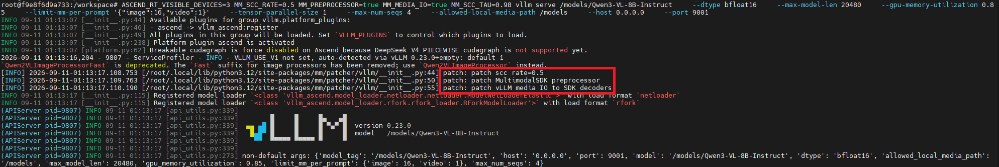

# patcher

> 简介：本节描述 Multimodal SDK 在 vLLM 中提供的特性开关。通过设置以下环境变量，可以在**不修改 vLLM 源码**的前提下开启 SCC 视觉 token 压缩、预处理加速等能力。

---

## 公共前置条件

使用以下任一特性前，请完成以下准备工作：

- 安装 Multimodal SDK。

> Multimodal SDK 以 vLLM plugin 的方式被自动加载（vLLM 启动时会扫描 `mm.patcher.vllm` 入口）。

---

## 环境变量

下表中的所有变量在 vLLM 启动时被 `mm.patcher.vllm.patch()` 一次性读取，并决定是否激活对应的 monkey patch。

| 环境变量 | 类型 | 取值范围 | 默认值 | 说明 |
| --- | --- | --- | --- | --- |
| `MM_SCC_RATE` | float | `(0, 1]` | `1.0` | SCC 视觉 token 压缩比。`1.0` 表示关闭压缩；值越小，压缩后保留的 token 越少，推理越快，但可能损失精度。 |
| `MM_SCC_TAU` | float | `(0, 1]` | `0.95` | SCC 划分的余弦相似度阈值。值越高，合并条件越严格，信息损失越小，压缩收益越弱。 |
| `MM_SCC_EPSILON` | float | `(0, 1)` | `0.05` | 近似 Union-Find 的采样误差容忍度，仅 CPU 回退路径使用。 |
| `MM_SCC_MAX_TOKENS_PER_ITEM` | int | `[0, 65536]` | `8192` | 单样本 token 上限。超过该值的样本**不参与 SCC 压缩**，直接送 LLM。`0` 表示不限制。 |
| `MM_PREPROCESSOR` | bool | `true` / `false` | `false` | 开启 SDK 的图像/视频预处理加速（走 `mm.core.processor.resize_and_normalize`）。 |

任意一个变量设为非法值时，Multimodal SDK 会在 vLLM 日志中打印 warning 并回退到默认值，不会让 vLLM 启动失败。

### 关闭 SDK 加速

- **关闭 SCC 视觉 token 压缩**：`MM_SCC_RATE=1.0`（或留空使用默认值）。
- **关闭预处理加速**：`MM_PREPROCESSOR=false`（或留空）。

关闭行为不影响 vLLM 服务本身启动，只是不再注入对应的 monkey patch。

---

## 适用模型

设置上述环境变量后，SCC 与预处理加速会在以下模型上自动生效（vLLM 加载到对应模型类时，Multimodal SDK 会按需注入 monkey patch）：

| 模型 | SCC 视觉 token 压缩 | 预处理加速 |
| --- | --- | --- |
| **Qwen2.5-VL-7B-Instruct** | ✓ | ✓ |
| **Qwen3-VL-8B-Instruct** | ✓ | ✓ |
| **Qwen3.5-9B** | ✓ | ✓ |
| **Qwen3.6-27B** | ✓ | ✓ |

其他模型不涉及 patch 操作，因此不受影响。

---

## 版本与分支对应

Multimodal SDK 历史上针对 **vllm-ascend** 各版本提供过不同的 patch，不同 patch 适配的 vLLM 入口 API 互不兼容，需要在对应分支查看。
本节只说明各版本支持的模型以及加速的部分，具体 SCC / 预处理操作请参见上文 [环境变量](#环境变量) 与 [启动 vLLM](#启动-vllm)。

| 适配的 vllm-ascend | 分支 | 支持的模型 | 加速的部分 |
| --- | --- | --- | --- |
| **v0.23.0rc1**（本文档默认） | `master` | Qwen2.5-VL · Qwen3-VL · Qwen3.5-VL · Qwen3.6-VL | SCC 视觉 token 压缩；图像 / 视频预处理加速 |
| **v0.8.5rc1** | `branch_v26.0.0` · `branch_v26.1.0` | Qwen2-VL · InternVL2 | 视频解码加速；Qwen2-VL / InternVL2 图像预处理加速 |

> **功能详解口径**：本文档**只**针对 `master` 分支下的 vllm-ascend v0.23.0rc1 描述；`branch_v26.x` 版本的旧 patch 使用另一套接入方式，具体用法请查阅对应分支的 `patcher.md`文档。

---

## 启动 vLLM

设置好环境变量之后，**直接使用原生的 `vllm serve` 命令即可**，无需任何额外 SDK 侧参数。例如，启用 SCC + 预处理加速跑 Qwen3-VL-8B-Instruct：

```bash
MM_SCC_RATE=0.5 \
MM_SCC_TAU=0.95 \
MM_SCC_EPSILON=0.05 \
MM_SCC_MAX_TOKENS_PER_ITEM=8192 \
MM_PREPROCESSOR=true \
vllm serve /models/Qwen3-VL-8B-Instruct \
    --host 0.0.0.0 \
    --port 9000
```

### 确认 patch 生效

启动日志里，在开始部分如能看到下列任一行，即说明对应 patch 已被加载：

| 日志关键字 | 含义 |
| --- | --- |
| `patch scc rate=<value>` | SCC 视觉 token 压缩已注入（`MM_SCC_RATE < 1.0`） |
| `patch MultimodalSDK preprocessor` | 图像 / 视频预处理加速已注入（`MM_PREPROCESSOR=true`） |

如下图所示，启动日志中包含 SCC 视觉 token 压缩已注入（`MM_SCC_RATE < 1.0`）的提示行。



---

## 常见参数调优

| 场景 | 推荐调整 |
| --- | --- |
| 掉点明显 | 收紧 `MM_SCC_TAU`（如 `0.98`），或适当提高 `MM_SCC_RATE`（如 `0.7`）。 |
| 想要更激进的压缩 | 降低 `MM_SCC_RATE`（如 `0.3`）。 |

---

## 参考资料

- `MultimodalSDK/source/mm/patcher/vllm/__init__.py` — 插件入口与开关逻辑
- `MultimodalSDK/source/mm/patcher/vllm/constants.py` — 环境变量定义与校验
- `MultimodalSDK/source/mm/core/scc/compressor.py` — SCC 视觉 token 压缩算法
- `MultimodalSDK/source/mm/core/processor.py` — `resize_and_normalize` 实现
