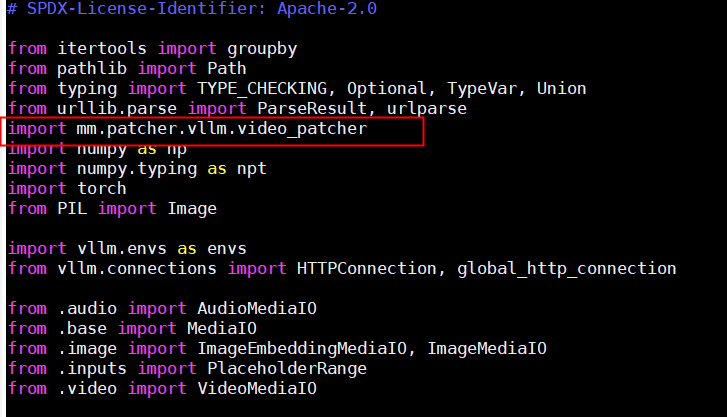
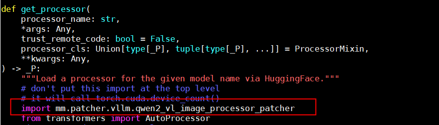
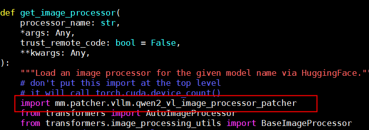
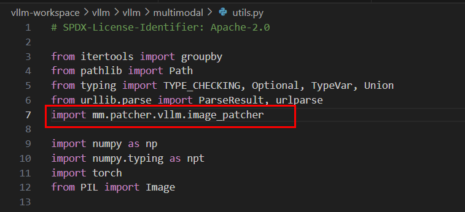
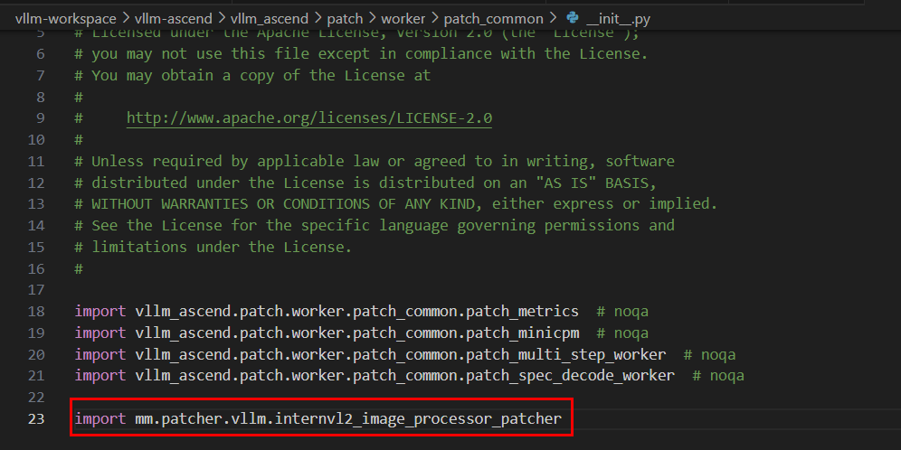

# patcher<a name="ZH-CN_TOPIC_0000002466503045"></a>

## video\_patcher<a name="ZH-CN_TOPIC_0000002466422897"></a>

该补丁为vllm视频解码提供加速能力，可以大幅度提升视频文件的读取，解码效率。

>[!CAUTION] 注意 
>-   使用补丁时，目前仅支持从vllm-ascend社区获取0.8.5.rc1镜像版。
>-   镜像的安装方式请参见[vllm-ascend](https://vllm-ascend.readthedocs.io/en/v0.8.5rc1/installation.html)，安装时请选择Using docker（从容器中安装）。
>-   在镜像中使用Multimodal SDK能力时，请首先执行以下命令：
>     ```
>     export LD_LIBRARY_PATH=/usr/local/Ascend/driver/lib64:/usr/local/Ascend/driver/lib64/common:/usr/local/Ascend/driver/lib64/driver:$LD_LIBRARY_PATH
>     ```

**使用方式<a name="section1587174015349"></a>**

本文档仅提供通过社区获取镜像的使用方式，对于其他使用方式，您需要自行找到以下所提到的文件并执行操作。

您需要在vllm包的utils.py文件中添加如下内容，该文件路径在镜像中的位置为“/vllm-workspace/vllm/vllm/multimodal/utils.py“。

```
import mm.patcher.vllm.video_patcher
```

共计需要添加一个位置，在文件头添加以上内容即可，如下图所示。



添加成功后，当使用vllm服务并传入视频文件数据时，若可以看到如下提示信息，则表示使用成功。

```
load_file: Multimodal SDK Video Patcher Enabled!
```

>[!CAUTION] 注意 
>当前加速能力仅针对视频文件，且格式应为mp4，文件权限不应高于640。

**示例请求体<a name="section121110388208"></a>**

以下是一个示例请求体，无法直接复制使用，对于其他vllm的参数请参见[vllm的官方文档](https://docs.vllm.ai/en/v0.8.5/serving/openai_compatible_server.html#chat-api)。

请求体应发送至vllm服务化的OpenAI接口中，本文使用“/v1/chat/completion“。

```
{
  "model": "/home/Qwen2-VL-7B-Instruct",  // 模型路径
  "messages": [
    {
      "role": "user",
      "content": [
        {
          "type": "video_url",
          "video_url": {
            "url": "file:/home/234_chunk_0001.mp4"
          }  // 视频文件本地路径
        },
        {
          "type": "text",
          "text": "describe the video"
        }  // 用户输入的文本提示词
      ]
    }
  ],
  "max_tokens": 100,   // 输出的最大token数
  "temperature": 0,    // 控制生成的随机性（越低越确定性）
  "top_p": 0.1,        // nucleus sampling参数
  "stream": false      // 是否使用流式输出
}
```


## qwen2\_vl\_image\_processor\_patcher<a name="ZH-CN_TOPIC_0000002432824506"></a>

该补丁为vllm在使用Qwen2VL模型时的图像/视频预处理提供加速能力，对比transformers的预处理时延可大幅度缩短。

>[!CAUTION] 注意 
>-   使用补丁时，目前仅支持从vllm-ascend社区获取0.8.5.rc1镜像版，且需要保证transformers的版本为4.51.3。
>-   镜像的安装方式请参见[vllm-ascend](https://vllm-ascend.readthedocs.io/en/v0.8.5rc1/installation.html)，安装时请选择Using docker（从容器中安装）。
>-   在镜像中使用Multimodal SDK能力时，请首先执行以下命令：
>     ```
>     export LD_LIBRARY_PATH=/usr/local/Ascend/driver/lib64:/usr/local/Ascend/driver/lib64/common:/usr/local/Ascend/driver/lib64/driver:$LD_LIBRARY_PATH
>     ```

**使用方式<a name="section1587174015349"></a>**

本文档仅提供通过社区获取镜像的使用方式，对于其他使用方式，您需要自行找到以下所提到的文件并执行操作。

您需要在vllm包的processor.py文件中添加如下内容，该文件路径在镜像中的位置为“/vllm-workspace/vllm/vllm/transformers\_utils/processor.py“。

```
import mm.patcher.vllm.qwen2_vl_image_processor_patcher
```

共计需要添加以下两个位置：

在函数get\_processor中的from transformer import AutoProcessor的前一行添加，若使用容器，则为62-63行，如下图所示。



在函数get\_image\_processor中的from transformer import AutoImageProcessor的前一行添加，若使用容器，则为174-175行，如下图所示。



添加成功后，当正常运行vllm服务时，在正常对话后若可以看到如下提示信息，则表示使用了多模态Qwen2VL图像/视频预处理加速功能。

```
get_image_processor_class_from_name: Multimodal SDK Qwen2 VL Image Patcher Enabled!
```

**示例请求体<a name="section121110388208"></a>**

以下是一个视频示例请求体，无法直接复制使用，对于其他vllm的参数请参见[vllm的官方文档](https://docs.vllm.ai/en/v0.8.5/serving/openai_compatible_server.html#chat-api)。

请求体应发送至vllm服务化的OpenAI接口中，本文使用“/v1/chat/completions“。

```
{
  "model": "/home/Qwen2-VL-7B-Instruct",  // 模型路径
  "messages": [
    {
      "role": "user",
      "content": [
        {
          "type": "video_url",
          "video_url": {
            "url": "file:/home/234_chunk_0001.mp4"
          }  // 视频文件本地路径
        },
        {
          "type": "text",
          "text": "describe the video"
        }  // 用户输入的文本提示词
      ]
    }
  ],
  "max_tokens": 100,   // 输出的最大token数
  "temperature": 0,    // 控制生成的随机性（越低越确定性）
  "top_p": 0.1,        // nucleus sampling参数
  "stream": false      // 是否使用流式输出
}
```

以下是一个图像示例请求体，无法直接复制使用，对于其他vllm的参数请参见[vllm的官方文档](https://docs.vllm.ai/en/v0.8.5/serving/openai_compatible_server.html#chat-api)。

```
{
  "model": "/home/Qwen2-VL-7B-Instruct",  // 模型路径
  "messages": [
    {
      "role": "user",
      "content": [
        {
          "type": "image_url",
          "image_url": {
            "url": "file:/home/test.jpg"
          }  // 图像文件本地路径
        },
        {
          "type": "text",
          "text": "describe the image"
        }  // 用户输入的文本提示词
      ]
    }
  ],
  "max_tokens": 100,   // 输出的最大token数
  "temperature": 0,    // 控制生成的随机性（越低越确定性）
  "top_p": 0.1,        // nucleus sampling参数
  "stream": false      // 是否使用流式输出
}
```


## image\_patcher<a name="ZH-CN_TOPIC_0000002435078758"></a>

该补丁为vllm图片解码提供加速能力，可以大幅度提升图片文件的读取，解码效率。

>[!CAUTION] 注意 
>-   使用补丁时，目前仅支持从vllm-ascend社区获取0.8.5.rc1镜像版。
>-   镜像的安装方式请参见[vllm-ascend](https://vllm-ascend.readthedocs.io/en/v0.8.5rc1/installation.html)，安装时请选择Using docker（从容器中安装）。
>-   在镜像中使用Multimodal SDK能力时，请首先执行以下命令：
>     ```
>     export LD_LIBRARY_PATH=/usr/local/Ascend/driver/lib64:/usr/local/Ascend/driver/lib64/common:/usr/local/Ascend/driver/lib64/driver:$LD_LIBRARY_PATH
>     ```

**使用方式<a name="section1587174015349"></a>**

本文档仅提供通过社区获取镜像的使用方式，对于其他使用方式，您需要自行找到以下所提到的文件并执行操作。

您需要在vllm包的utils.py文件中添加如下内容，该文件路径在镜像中的位置为“/vllm-workspace/vllm/vllm/multimodal/utils.py“。

```
import mm.patcher.vllm.image_patcher
```

在文件头位置添加以上内容即可，如下图所示。



添加成功后，当使用vllm服务并传入视频文件数据时，若可以看到如下提示信息，表示使用成功。

```
load_file: Multimodal SDK Image Patcher Enabled!
```

>[!CAUTION] 注意 
>当前加速能力仅针对jpeg图像，且文件后缀应为jpg或jpeg，文件权限不应高于640。

**示例请求体<a name="section121110388208"></a>**

以下是一个示例请求体，无法直接复制使用，对于其他vllm的参数请参见[vllm的官方文档](https://docs.vllm.ai/en/v0.8.5/serving/openai_compatible_server.html#chat-api)。

请求体应发送至vllm服务化的OpenAI接口中，本文使用“/v1/chat/completion“。

```
{
  "model": "/home/models/internVL2",  // 模型路径
  "messages": [{
    "role":"user",
    "content":[
	{"type": "image_url", "image_url": {"url": "file:/home/test.jpg"}}, // 本地图像路径
        {"type": "text", "text": "describe the image"}
      ]
    }],
"max_tokens": 100, // 输出的最大token数
"temperature": 0.1, // 控制生成的随机性（越低越确定性）
"top_p":0.1, // nucleus sampling参数
"stream": false // 是否使用流式输出
}
```


## internvl2\_image\_processor\_patcher<a name="ZH-CN_TOPIC_0000002468677037"></a>

该补丁为vllm在使用InternVL2模型时的图像处理提供加速能力。

>[!CAUTION] 注意 
>-   使用补丁时，目前仅支持从vllm-ascend社区获取0.8.5.rc1镜像版，且需要保证transformers的版本为4.51.3。
>-   镜像的安装方式请参见[vllm-ascend](https://vllm-ascend.readthedocs.io/en/v0.8.5rc1/installation.html)，安装时请选择Using docker（从容器中安装）。
>-   在镜像中使用Multimodal SDK能力时，请首先执行以下命令：
>     ```
>     export LD_LIBRARY_PATH=/usr/local/Ascend/driver/lib64:/usr/local/Ascend/driver/lib64/common:/usr/local/Ascend/driver/lib64/driver:$LD_LIBRARY_PATH
>     ```

**使用方式<a name="section1587174015349"></a>**

本文档仅提供通过社区获取镜像的使用方式，对于其他使用方式，您需要自行找到以下所提到的文件并执行操作。

您需要在vllm-ascend包的文件中添加如下内容，该文件路径在镜像中的位置为“/vllm-workspace/vllm-ascend/vllm\_ascend/patch/worker/patch\_common/\_\_init\_\_.py“。

```
import mm.patcher.vllm.internvl2_image_processor_patcher
```

添加位置如下图所示：



添加成功后，当正常运行vllm服务时，在正常对话后若可以看到如下提示信息，表示使用了多模态Qwen2VL图像/视频预处理加速功能。

```
_images_to_pixel_values_lst: Multimodal SDK InternVL2 Image Patcher Enabled!
```

**示例请求体<a name="section121110388208"></a>**

以下是一个图像示例请求体，无法直接复制使用，对于其他vllm的参数请参见[vllm的官方文档](https://docs.vllm.ai/en/v0.8.5/serving/openai_compatible_server.html#chat-api)。

```
{
  "model": "/home/models/internVL2",  // 模型路径
  "messages": [{
    "role":"user",
    "content":[
	{"type": "image_url", "image_url": {"url": "file:/home/test.jpg"}}, // 本地图像路径
        {"type": "text", "text": "describe the image"}
      ]
    }],
"max_tokens": 100, // 输出的最大token数
"temperature": 0.1, // 控制生成的随机性（越低越确定性）
"top_p":0.1, // nucleus sampling参数
"stream": false // 是否使用流式输出
}
```


