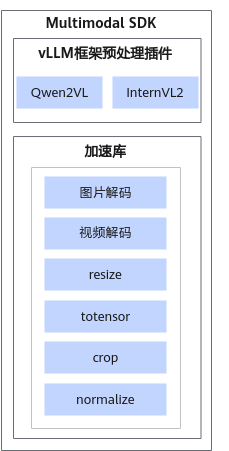

# 简介

多模态大模型推理流程中需要处理大量复杂的数据。Multimodal SDK通过提供一系列高性能的昇腾设备亲和性接口，加速大模型推理预处理流程。

-   包括图像视频加载和解码，resize、crop等预处理常用操作。
-   支持多种开源数据结构与加速库数据结构的相互转换，方便快速使用和移植。

**使用导引**

如果您是第一次使用本软件，可以从快速入门中的样例开始上手，并请确认按照其中步骤准备好相关环境和软件包。

如果您对于相关流程已经比较熟悉，可以直接跳转到API接口章节获取需要的函数功能和接口，加速您的数据处理流程。

# 软件架构

Multimodal SDK软件架构如[图1](#fig92951326193419)所示。

**图 1**  Multimodal SDK软件架构  

**表 1**  架构图模块介绍

|模块|说明|
|--|--|
|vLLM框架预处理插件|使用vLLM进行大模型推理时提供加速能力。<ul><li>Qwen2VL：使用Qwen2VL模型时提供图像/视频预处理加速能力，对比transformers的预处理时延可大幅度缩短。</li><li>InternVL2：使用InternVL2模型时提供图像/视频预处理加速能力。</li></ul>|
|加速库|提供一系列高性能图像和张量处理接口。|

# 支持的硬件和操作系统

|产品系列|产品型号|操作系统版本|
|--|--|--|
|Atlas A2 推理系列产品|Atlas 800I A2 推理服务器|Ubuntu 22.04|

