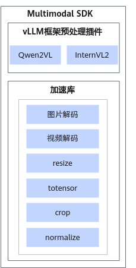

# 简介

多模态大模型推理流程中需要处理大量复杂的数据。Multimodal SDK 通过提供一系列高性能的昇腾设备亲和性接口，加速大模型推理预处理流程。

- 包括图像视频加载和解码，resize、crop 等预处理常用操作。
- 支持多种开源数据结构与加速库数据结构的相互转换，方便快速使用和移植。

**使用导引**

如果您是第一次使用本软件，可以从[快速入门](./quick_start.md)中的样例开始上手，并请确认按照[安装部署](./installation_guide.md)中的步骤准备好相关环境和软件包。

如果您对于相关流程已经比较熟悉，可以直接跳转到 [API 接口](./api/README.md)章节获取需要的函数功能和接口，加速您的数据处理流程。

# 软件架构

Multimodal SDK 软件架构如下图所示。

**图 1** Multimodal SDK 软件架构

**表 1** 架构图模块介绍

| 模块 | 说明 |
| -- | -- |
| vLLM 框架预处理插件 | 使用 vLLM 进行大模型推理时提供加速能力。Qwen2VL：使用 Qwen2VL 模型时提供图像/视频预处理加速能力，对比 transformers 的预处理时延可大幅度缩短。InternVL2：使用 InternVL2 模型时提供图像/视频预处理加速能力。 |
| 加速库 | 提供一系列高性能图像和张量处理接口。 |

# 支持的硬件和操作系统

| 产品系列 | 产品型号 | 操作系统版本 |
| -- | -- | -- |
| Atlas A2 推理系列产品 | Atlas 800I A2 推理服务器 | Ubuntu 22.04 |
