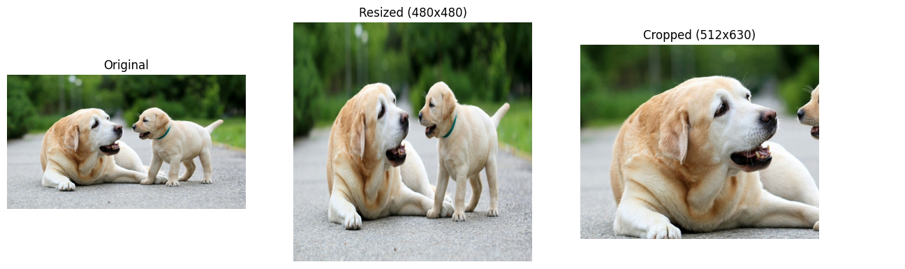
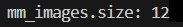
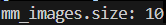

# 样例和指导<a name="ZH-CN_TOPIC_0000002423192140"></a>

## 图片处理<a name="ZH-CN_TOPIC_0000002456790945"></a>

以下是一个简单的参考样例，通过多模态SDK的Image读取并进行缩放、裁剪，最后转化为通用的Numpy数组展示上述操作的效果。

```
import mm # 引入多模态SDK包
import matplotlib.pyplot as plt # 仅做图像展示使用

dog_img = mm.Image.open("/home/test.jpg") # 通过多模态Image类，从实际文件构造Image变量（注意文件权限不能超过640）
dog_resized_img = dog_img.resize((480,480), mm.Interpolation.BICUBIC, mm.DeviceMode.CPU) # 对构造的图像进行缩放操作
dog_cropped_img = dog_img.crop(100, 100, 512, 630, mm.DeviceMode.CPU) # 对构造的图像进行裁剪操作

resized_np = dog_resized_img.numpy() # 将缩放的图像转化为Numpy数组，方便后续对其进行展示
cropped_np = dog_cropped_img.numpy() # 将裁剪的图像转化为Numpy数组，方便后续对其进行展示
original_dog = dog_img.numpy() # 将构造的原图像转化为Numpy数组，方便后续对其进行展示

# 以下为展示图像代码
plt.figure(figsize=(15, 5))

plt.subplot(1, 3, 1)
plt.title("Original")
plt.imshow(original_dog)
plt.axis("off")

plt.subplot(1, 3, 2)
plt.title("Resized (480x480)")
plt.imshow(resized_np)
plt.axis("off")

plt.subplot(1, 3, 3)
plt.title("Cropped (512x630)")
plt.imshow(cropped_np)
plt.axis("off")

plt.show()
```




## 视频处理<a name="ZH-CN_TOPIC_0000002456910797"></a>

多模态SDK提供的视频解码接口有两个自定义参数可供用户选择使用，根据优先级，若传入期望解码的视频帧ID合法，优先按照期望解码的视频帧ID进行解码，解码返回的视频帧image对象列表大小为传入的期望解码的视频帧ID列表大小。若帧ID列表为空，传入合法的期望解码后获取的总帧数，返回得到解码后的视频帧image对象列表大小为期望解码后获取的总帧数大小。

1.  传入目标解码的帧ID集合，得到的返回值列表大小为传入的帧ID集合大小。

    ```
    from mm import video_decode
    import os
    
    norm_file_path = "/home/test/xxx.mp4" #要解码的视频文件地址
    os.chmod(norm_file_path, 0o640) #修改权限
    mm_images = video_decode(norm_file_path, "cpu", [0, 48, 96, 145, 193, 241, 290, 338, 386, 435, 483, 531], 10)
    print(f"mm_images.size: {len(mm_images)}")
    ```

    

2.  传帧ID列表为空，传入期望解码后获取的总帧数，得到的返回值列表大小为传入的期望解码后获取的总帧数大小。

    ```
    from mm import video_decode
    import os
    
    norm_file_path = "/home/test/xxx.mp4" #要解码的视频文件地址
    os.chmod(norm_file_path, 0o640) #修改权限
    mm_images = video_decode(norm_file_path, "cpu", [], 10)
    print(f"mm_images.size: {len(mm_images)}")
    ```

    


